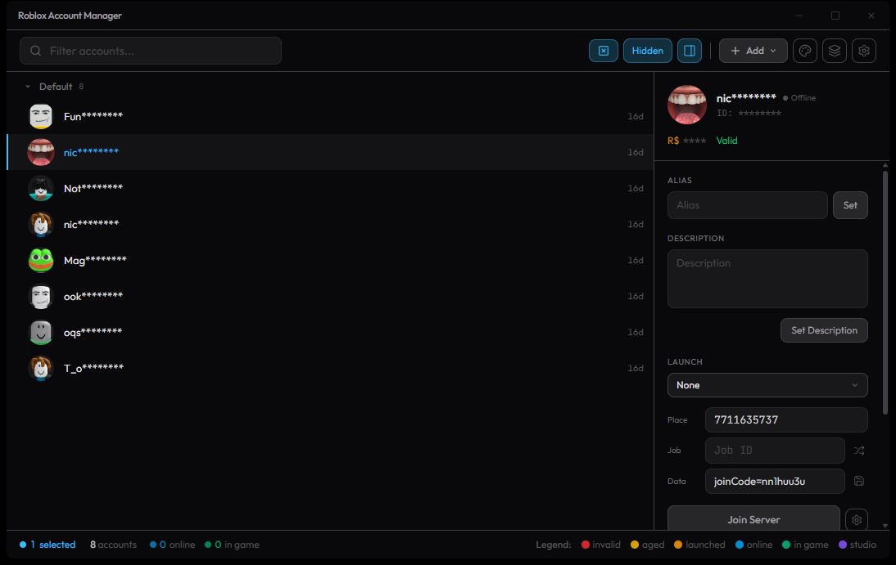

[English](README.md) | **Português**

# RAM — Roblox Account Manager


<p align="center">
  <a href="https://github.com/luanmacea/roblox-account-manager/releases/latest/download/Roblox-Account-Manager-Setup.msi"></a>
  <br>
  <sub>Windows 10/11 · <a href="https://github.com/luanmacea/roblox-account-manager/releases/latest">outros downloads (portátil, versão completa)</a> · <a href="https://roblox-account-manager-app.pages.dev/">🌐 site</a></sub>
</p>

[](https://github.com/luanmacea/roblox-account-manager/releases/latest)

**O Roblox Account Manager feito para a melhor experiência de uso.** Todas as suas contas Roblox num lugar só, quantos clientes do Roblox você quiser abertos ao mesmo tempo e suas alts sem nunca precisar deslogar — com Auto Rejoin, anti-AFK, busca de servidor, entrada no servidor de amigos, contas criptografadas e muito mais.

Rápido e leve: reescrito do zero em **Rust + TypeScript** com [Tauri](https://tauri.app/). Não precisa instalar .NET nem VC++.

Todo o crédito a [ic3w0lf22](https://github.com/ic3w0lf22), que criou o Roblox Account Manager original, e a [niccdevs](https://github.com/niccdevs), que o manteve depois. Este projeto continua o trabalho deles.

Achou um bug ou tem uma ideia? Abra uma [issue](https://github.com/luanmacea/roblox-account-manager/issues).

# ⚠️ Aviso
Nunca gere um "rbx-player link" a pedido de terceiros — quem tiver esse link pode entrar em qualquer jogo (ou até no Roblox Studio) com a sua conta, gastar seu Robux ou fazer você ser banido.

# Download
**[⬇ Baixar o instalador (.msi)](https://github.com/luanmacea/roblox-account-manager/releases/latest/download/Roblox-Account-Manager-Setup.msi)** — é só isso que a maioria precisa. Sai 0/75 no VirusTotal, instala só para o seu usuário (**sem pedir administrador**) e se atualiza sozinho.

Baixe só deste repositório. A [página da release](https://github.com/luanmacea/roblox-account-manager/releases/latest) também tem:

- **Portátil:** o app sem instalar nada. Não cria atalho nem se atualiza sozinho.
- **Arquivos com `_full-nexus-ws`:** a versão completa, com a API HTTP local e o Nexus (abre portas de rede locais). Só se você precisar.
- Os arquivos `zz-…sig` são da atualização automática: não precisa baixá-los.

> Instalou pelo antigo `-setup.exe`? Ele não é mais publicado, então não se atualiza mais. Desinstale em Configurações do Windows → Aplicativos e instale o `.msi` uma vez — suas contas e configurações continuam.

# Funcionalidades

### Contas
| Funcionalidade | O que faz |
| :--- | :--- |
| Várias formas de adicionar | Login pelo navegador, cookie, `usuario:senha`, `usuario:senha:cookie`, arrastar um cookie para a lista, ou importar o `AccountData.json` do RAM antigo |
| Criador de contas | Cria contas de graça no navegador embutido: o app preenche nome, senha, data e gênero, você só resolve o CAPTCHA. Prefixo de nome para o lote inteiro |
| Contas criptografadas | As contas ficam sempre criptografadas no disco — com a sua senha, ou com uma chave do aparelho se você não definir uma. "Lembrar senha" opcional |
| Grupos e ordem | Arrastar e soltar, grupos, ordem manual que sobrevive a fechar o app, alias de até 240 caracteres, descrição, campos livres |
| Status ao vivo | Quem está online, em jogo ou no Studio, qual sessão expirou e quais contas estão paradas há 20+ dias |
| Utilitários da conta | Display name, privacidade, trocar senha/e-mail, PIN, encerrar outras sessões, bloqueios, outfits, avatar por JSON, código do Quick Login |
| Make Friends | Faz todas as contas virarem amigas entre si (mesh) ou de uma conta (star), com intervalo configurável |
| Modo streamer | Esconde os nomes de usuário na lista para gravar ou fazer live |
| Backups | Cria, lista e restaura backups de contas, settings, scripts e temas de dentro do app |

### Jogar
| Funcionalidade | O que faz |
| :--- | :--- |
| Multi Roblox | Quantos clientes do Roblox você quiser ao mesmo tempo |
| Multi Launch | Lança uma seleção inteira de contas no mesmo jogo ou servidor, uma por vez com atraso seguro |
| Busca de servidor | Varre os servidores do jogo e escolhe o melhor para o seu grupo: *Best fit* (o mais cheio em que todos ainda cabem), mais cheio, mais vazio ou aleatório. Filtro de região e checagem de "sem permissão" |
| Links de entrada | Cole qualquer link — jogo, servidor privado/VIP, link de compartilhamento, convite, deep link — e todos entram |
| Amigos | Amigos online de cada conta e o grupo inteiro no servidor de um amigo. Seguir um jogador pelo nome |
| Favoritos e recentes | Jogos salvos com vários links VIP cada; jogos e servidores recentes |
| Versões do Roblox | Instala builds do Roblox lado a lado e escolhe qual abrir. Acha instalações do Bloxstrap, Fishstrap e Voidstrap |
| Grade de janelas | Organiza todas as janelas do Roblox em grade nos monitores escolhidos |
| Painel de sessão | Fila de launch (cancelável), clientes abertos (focar, fechar) e um console ao vivo explicando cada launch, rejoin e ação do Watcher |

### Automação
| Funcionalidade | O que faz |
| :--- | :--- |
| Auto Rejoin | Mantém suas alts num servidor: a cada N minutos cada alt é fechada e relançada, e as contas main ficam abertas e nunca são reiniciadas |
| AFK mode (anti-AFK) | Manda uma tecla **ou um clique** para a janela de cada conta a cada poucos minutos para ninguém ser kickado por inatividade — sem rejoin, sem perder progresso. Ponto do clique marcado uma vez para todas ou por conta |
| Watcher | Fecha o cliente que perdeu a conexão, ficou sem memória ou mudou de título (detecção de beta) |
| Otimização | Limite de FPS, gráficos, tamanho de janela, prioridade do processo, EcoQoS, limites de CPU/memória e FastFlags — um perfil para jogar normal e perfis separados para mains e alts do Auto Rejoin |
| Isolamento pré-launch | Limpa cache, rastros no registro, MachineGuid e MAC antes de cada launch para uma conta não herdar a sessão da outra (Windows, só com nenhum cliente aberto) |
| Scripts | Automação em JavaScript dentro do gerenciador (isolada, com permissões por script) pela API `ram.*` |
| API Web local / Nexus | API HTTP local e servidor WebSocket para ferramentas externas e o `Nexus.lua` (na build `_full-nexus-ws`) |

### App
| Funcionalidade | O que faz |
| :--- | :--- |
| Atualização automática | Procura versões novas e se atualiza sozinho |
| Temas | Editor de tema embutido: cores, estilo de botão e fontes, com presets exportáveis |
| Idiomas | Inglês e português (alemão parcial) |
| Modo de vídeo seguro | Se a janela abrir em branco, o app se recupera sozinho (ou segure **Shift** ao abrir) |

# FAQ

**Por que é detectado como vírus?**
O app não tem assinatura de código, e ferramentas que abrem processos de jogo são falso positivo comum nos modelos de aprendizado de máquina dos antivírus. Toda release é escaneada no VirusTotal e no Windows Defender, e o `.msi` sai limpo. O código é público (Rust + Tauri) — você pode auditar e compilar você mesmo. Baixe só das releases oficiais do GitHub.

**Como ativo o Multi Roblox?**
Settings → `General` → `Multi Roblox` (com o Roblox fechado).

**Por que o Multi Roblox vem desativado?**
A Byfron já declarou que múltiplos clientes podem ser vistos como comportamento suspeito — ative por sua conta e risco.

**Posso ser banido por usar isso?**
Não viola os Termos de Serviço do Roblox, mas alguns jogos proíbem alts — confira as regras do jogo antes.

**Como faço backup das minhas contas?**
Pelo app: Settings → `Misc` → `Data` → `Backups` → `Manage` ([detalhes](docs/features/backups.md)). O zip leva o `AccountData.key` junto — sem ele o backup não restaura —, então, **sem senha no app, quem tiver o zip consegue abrir as contas**. Se você guarda backup em nuvem, ponha senha antes (Settings → `Misc` → `Security` → `Change Encryption Method` → `Open` → `Pass Lock`).

**O app abriu com a janela em branco (ou preta). E agora?**
A interface é desenhada pelo Microsoft Edge WebView2 Runtime, então reinstalar o app não resolve. O app tenta se recuperar sozinho: se a interface não aparecer em 25 s, ele reabre com a aceleração de vídeo desligada. Para forçar esse modo, **segure Shift** enquanto o app abre (ou acrescente `--safe-mode` ao campo *Destino* do atalho). Se continuar em branco, repare o **Microsoft Edge WebView2 Runtime** em Configurações do Windows → Aplicativos → Aplicativos instalados → Modificar → Reparar, reinicie o Windows e atualize o driver de vídeo. [Detalhes](docs/features/webview-recovery.md).

**Como saio do modo de vídeo seguro?**
Uma faixa amarela no topo do app tem o botão **Voltar ao modo normal**. Se ela não aparecer, apague o arquivo `webview.safemode` que fica junto do `RAMSettings.ini` (por padrão em `%LOCALAPPDATA%\Roblox Account Manager`) e abra o app de novo.

**Funciona no Mac?**
Ainda não — o suporte a macOS é parcial.

# Versão 0.x (Beta)
Em desenvolvimento ativo: as versões 0.x vão até a primeira versão completamente corrigida, que será a 1.0.0. Espere bugs e mudanças de comportamento entre elas.

# Desenvolvimento

```bash
bun install              # dependências do frontend
bun run tauri dev        # roda o app em modo dev (hot reload)
bun run tauri build      # build de produção (instalador)
bun run check            # typecheck + todos os testes (vitest + cargo test)
```

O primeiro `tauri dev`/`tauri build` compila todas as crates Rust do zero e pode levar alguns minutos; os seguintes são incrementais. A documentação de desenvolvimento fica em [docs/](docs/README.md).

# Preview

