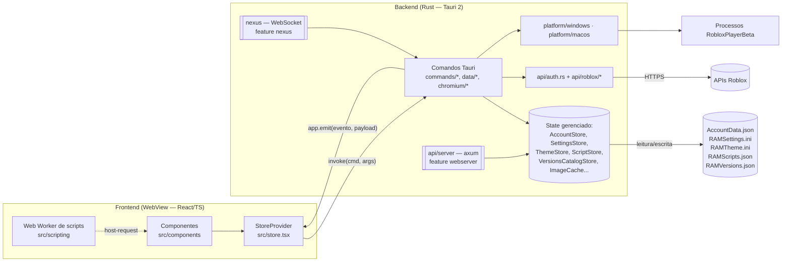

# Arquitetura

## Visão geral



## Divisão frontend / backend

- **Frontend** ([src/](../src)): React 19 + Vite. Todo o estado global fica em um único Context em [store.tsx](../src/store.tsx) (`StoreProvider`/`useStore`), que chama o backend com `invoke(...)` de `@tauri-apps/api/core` e escuta eventos com `listen(...)`.
- **Backend** ([src-tauri/src/](../src-tauri/src)): ponto de entrada em [main.rs](../src-tauri/src/main.rs) → `run()` em [lib.rs](../src-tauri/src/lib.rs).
- **IPC**: exclusivamente via comandos Tauri registrados em `tauri::generate_handler![...]` em [lib.rs](../src-tauri/src/lib.rs). Todos retornam `Result<T, String>`; o erro chega ao frontend como string (normalmente exibida via `setError`/toast).
- Os nomes de argumentos em Rust são `snake_case` e no `invoke` do frontend são `camelCase` (ex.: `user_id` ↔ `{ userId }` em [store.tsx](../src/store.tsx)).

### Exceções à regra "frontend não acessa rede"

A regra do projeto é que o frontend fala só com o backend, mas o código tem exceções reais:

| Onde | O quê |
|---|---|
| [ServersTab.tsx](../src/components/server-list/ServersTab.tsx) | `fetch("https://ipapi.co/<ip>/json/")` para descobrir a região de um servidor. |
| [ScriptsDialog.tsx](../src/components/dialogs/ScriptsDialog.tsx) | `fetch`/`WebSocket` em nome de scripts do usuário (`ram.http`, `ram.ws`), com permissão explícita. |
| [fontPresets.ts](../src/fontPresets.ts) | Carrega fontes de `fonts.googleapis.com`. |
| [server-list/types.ts](../src/components/server-list/types.ts) | Favoritos e recentes ficam em `localStorage` (`ram_favorite_games`, `ram_recent_games`), não no backend. |

## Organização do backend

- Os arquivos em `src-tauri/src/commands/*.rs` **não são módulos**: são inseridos em `lib.rs` via `include!("commands/xxx.rs")`. Por isso as funções ficam na raiz do crate e compartilham imports/helpers (ex.: `get_cookie` de [account_helpers.rs](../src-tauri/src/commands/account_helpers.rs), `run_with_session_retry` de [account_api.rs](../src-tauri/src/commands/account_api.rs)).
- O mesmo padrão aparece em `data/accounts.rs` e `data/settings.rs` (incluem `model.rs`, `store.rs`, `commands.rs` etc.) e em `api/roblox.rs`.
- `data/*`: stores e persistência. `api/*`: clientes HTTP (Roblox) e servidor HTTP local. `chromium/*`: navegador de login via CDP. `platform/*`: código específico de SO. `nexus/*`: WebSocket.

## Stores (estado no backend)

Registradas com `.manage(...)` em [lib.rs](../src-tauri/src/lib.rs) e acessadas nos comandos via `tauri::State<'_, T>`.

| Store | Definição | Estado interno | Arquivo |
|---|---|---|---|
| `AccountStore` | [data/accounts/store.rs](../src-tauri/src/data/accounts/store.rs) | `Mutex<Vec<Account>>` + `Mutex<Option<SessionKey>>` (segredo da sessão: senha do usuário ou chave do aparelho) | `AccountData.json` + `AccountData.key` |
| `SettingsStore` | [data/settings/store.rs](../src-tauri/src/data/settings/store.rs) | `Mutex<IniFile>` | `RAMSettings.ini` |
| `ThemeStore` | [data/settings/theme.rs](../src-tauri/src/data/settings/theme.rs) | tema atual | `RAMTheme.ini` |
| `ThemePresetStore` | [data/settings/presets.rs](../src-tauri/src/data/settings/presets.rs) | `Mutex<Vec<ThemePresetData>>` | `RAMThemePresets.json` |
| `ScriptStore` | [data/scripts.rs](../src-tauri/src/data/scripts.rs) | `Mutex<Vec<ManagedScript>>` | `RAMScripts.json` |
| `VersionsCatalogStore` | [data/versions.rs](../src-tauri/src/data/versions.rs) | catálogo de versões instaladas | `RAMVersions.json` |
| `ImageCache` | [api/batch.rs](../src-tauri/src/api/batch.rs) | `Arc<Mutex<...>>` (filas + cache de URLs) | memória |
| `UpdaterRuntimeState` | [commands/updater.rs](../src-tauri/src/commands/updater.rs) | estado do updater | memória |
| `ChromiumManager` | [chromium/manager.rs](../src-tauri/src/chromium/manager.rs) | processos Chromium de login | memória |

Observação: as stores de dados usam `Mutex<_>` simples; o `Arc` fica por conta do `State` do Tauri. Apenas `ImageCache` usa `Arc<Mutex<_>>` explicitamente. Todas as mutações de `AccountStore`, `SettingsStore` e `ScriptStore` regravam o arquivo inteiro imediatamente. O `AccountData.json` é gravado de forma atômica (`.json.tmp` + `atomic_replace`/`MoveFileExW`) e o `AccountStore` recusa gravar se o load inicial falhou ou se estiver bloqueado com arquivo criptografado (ver [accounts.md](features/accounts.md#regras-de-negócio)).

## Arquivos de persistência

O diretório base é a **pasta de dados do usuário**, resolvida uma vez por processo em `get_runtime_data_dir()` ([data/settings/paths.rs](../src-tauri/src/data/settings/paths.rs)), nesta ordem:

1. variável de ambiente `RAM_DATA_DIR` (pasta própria; usada também nos testes);
2. **modo portátil** — arquivo `portable.txt` ao lado do executável → a pasta do executável (comportamento das versões antigas, útil para pendrive);
3. `%LOCALAPPDATA%\Roblox Account Manager` no Windows (`~/Library/Application Support/...` no macOS, `$XDG_DATA_HOME` no Linux);
4. pasta do executável, se o perfil do usuário não existir.

**Migração:** na primeira execução, os arquivos que estavam ao lado do executável são **copiados** para a pasta nova (`migrate_data_files`). A cópia nunca sobrescreve um arquivo já existente no destino e **nunca apaga a origem** — voltar para uma versão antiga do app continua funcionando.

| Arquivo | Onde | Formato | Código |
|---|---|---|---|
| `AccountData.json` | pasta de dados | **Sempre** binário criptografado com header RAM (senha do usuário ou chave do aparelho). JSON puro em PascalCase só é **lido**, para migrar arquivos de RAM v3/v4 | [data/accounts/commands.rs](../src-tauri/src/data/accounts/commands.rs) `get_account_data_path` |
| `AccountData.key` | pasta de dados, ao lado do vault | JSON com a chave mestra de 32 bytes embrulhada duas vezes (DPAPI do usuário + hash do aparelho). Existe só quando **não** há senha de usuário | [data/vault_key.rs](../src-tauri/src/data/vault_key.rs) `key_file_path_for` |
| `RAMSettings.ini` | pasta de dados | INI | [paths.rs](../src-tauri/src/data/settings/paths.rs) `get_settings_path` |
| `RAMTheme.ini` | pasta de dados | INI (seção `Roblox Account Manager`, fallback `RBX Alt Manager`) | [paths.rs](../src-tauri/src/data/settings/paths.rs), [theme.rs](../src-tauri/src/data/settings/theme.rs) |
| `RAMThemePresets.json` | pasta de dados | JSON | [paths.rs](../src-tauri/src/data/settings/paths.rs) |
| `RAMThemeFonts/` | pasta de dados | fontes importadas, nomeadas por SHA-256 | [commands.rs](../src-tauri/src/data/settings/commands.rs) `import_theme_font_asset` |
| `RAMScripts.json` | pasta de dados | JSON (camelCase) | [data/scripts.rs](../src-tauri/src/data/scripts.rs) `get_scripts_path` |
| `RAMVersions.json` | `%LOCALAPPDATA%\Roblox Account Manager\` (se `LOCALAPPDATA` não existir: pasta do exe) | JSON, escrita atômica via `.json.tmp` | [data/versions.rs](../src-tauri/src/data/versions.rs) `get_versions_catalog_path` |
| `RobloxVersions/` | `%LOCALAPPDATA%\Roblox Account Manager\` | versões do cliente instaladas | [data/versions.rs](../src-tauri/src/data/versions.rs) `ram_managed_versions_root` |
| `AccountControlData.json` | pasta de dados | JSON (lista de contas do Nexus) | [nexus/websocket/server_impl.rs](../src-tauri/src/nexus/websocket/server_impl.rs) `data_path` |
| `backups/*.zip` | pasta de dados | zip com os arquivos acima + manifesto | [commands/backups.rs](../src-tauri/src/commands/backups.rs) |

Regras:
- Na primeira execução com `%LOCALAPPDATA%` disponível, se existir um `RAMVersions.json` legado ao lado do exe, ele é **copiado** para o novo local.
- Os caminhos dependem do exe; em `bun run tauri dev` os arquivos ficam ao lado do binário de debug em `src-tauri/target/debug/`.

## Feature flags

### Backend (Cargo)

Definidas em [Cargo.toml](../src-tauri/Cargo.toml):

```toml
[features]
default = ["nexus", "webserver"]
nexus = []
webserver = ["dep:axum"]
```

- `nexus`: compila o módulo `nexus` (`#[cfg(feature = "nexus")] mod nexus;` em [lib.rs](../src-tauri/src/lib.rs)).
- `webserver`: compila o servidor axum em [api/server.rs](../src-tauri/src/api/server.rs).
- Os comandos `start_web_server`, `start_nexus_server`, `get_nexus_*` etc. em [services.rs](../src-tauri/src/commands/services.rs) têm **duas versões** (`#[cfg(feature = ...)]` e `#[cfg(not(feature = ...))]`), então o `generate_handler!` sempre compila; sem a feature, eles retornam erro/estado vazio.

### Frontend (Vite)

[featureFlags.ts](../src/featureFlags.ts) lê variáveis de ambiente de build:

| Constante | Variável | Default | Efeito |
|---|---|---|---|
| `ENABLE_NEXUS` | `VITE_ENABLE_NEXUS` | `true` | Mostra botão Nexus no [Toolbar](../src/components/layout/Toolbar.tsx) e monta o `NexusDialog` em [App.tsx](../src/App.tsx). |
| `ENABLE_WEBSERVER` | `VITE_ENABLE_WEBSERVER` | `true` | Inclui a aba WebServer em [SettingsDialog.tsx](../src/components/settings/SettingsDialog.tsx) e o toggle em [DeveloperTab.tsx](../src/components/settings/DeveloperTab.tsx). |

Valores aceitos: `1/true/yes/on` e `0/false/no/off` (qualquer outro → default). As flags do frontend e do Cargo são **independentes**: a CI ([ci.yml](../.github/workflows/ci.yml)) builda as duas combinações ("full" e "standard" com `--no-default-features`).

## Isolamento de plataforma

- [platform/mod.rs](../src-tauri/src/platform/mod.rs) compila `platform::windows` só em `target_os = "windows"` e `platform::macos` só em `target_os = "macos"`.
- Os comandos que dependem de SO usam `#[cfg(target_os = "windows")]` dentro do corpo ou versões alternativas `#[cfg(not(target_os = "windows"))]` (ex.: [diagnostics.rs](../src-tauri/src/commands/diagnostics.rs), [isolation.rs](../src-tauri/src/commands/isolation.rs), [botting.rs](../src-tauri/src/commands/botting.rs)).
- Dependências Win32 (`windows-sys`) só entram em `cfg(windows)` no [Cargo.toml](../src-tauri/Cargo.toml).
- Descriptografia DPAPI legada (`try_decrypt_legacy_dpapi` em [crypto.rs](../src-tauri/src/data/crypto.rs)) só existe no Windows; nos demais SOs retorna `None`.

## Eventos backend → frontend

Emitidos com `app.emit(nome, payload)` e escutados com `listen(nome, ...)`.

| Evento | Emitido em | Payload | Quem escuta |
|---|---|---|---|
| `launch-log` | [launch_shared.rs](../src-tauri/src/commands/launch_shared.rs) `emit_launch_log` (uma conta) e `emit_session_log` (`userId` nulo) | `{ userId, level, step, message }` | [store.tsx](../src/store.tsx) (console, buffer de 500) — **histórico geral**: launch, Botting e Watcher. O `step` é a origem da linha e é desenhado no console |
| `launch-progress` | [launch.rs](../src-tauri/src/commands/launch.rs) | `{ userId, index, total }` | [store.tsx](../src/store.tsx) |
| `launch-complete` | [launch.rs](../src-tauri/src/commands/launch.rs) | `{}` | [store.tsx](../src/store.tsx) |
| `isolation-report` | [launch.rs](../src-tauri/src/commands/launch.rs) | relatório de isolamento | nenhum listener no frontend atualmente |
| `isolation-progress` | [platform/windows/isolation.rs](../src-tauri/src/platform/windows/isolation.rs) | progresso | [IsolationProgressOverlay.tsx](../src/components/IsolationProgressOverlay.tsx) |
| `account-moderated` | [launch_shared.rs](../src-tauri/src/commands/launch_shared.rs) `mark_account_moderated` | `{ userId, group: "moderadas" }` | [store.tsx](../src/store.tsx) (recarrega contas + toast com o nome lido de `accountsRef`, não de estado capturado) |
| `roblox-optimization-warning` | [launch_shared.rs](../src-tauri/src/commands/launch_shared.rs) | aviso de otimização | [store.tsx](../src/store.tsx) |
| `botting-status` | [launch_shared.rs](../src-tauri/src/commands/launch_shared.rs) `emit_botting_status` | `BottingStatusPayload` | [store.tsx](../src/store.tsx) |
| `botting-account-cycle` | [botting.rs](../src-tauri/src/commands/botting.rs) | `{ userId, ok, error }` | [store.tsx](../src/store.tsx) |
| `botting-stopped` | [botting.rs](../src-tauri/src/commands/botting.rs) | `{}` | [store.tsx](../src/store.tsx) |
| `generator-status` | [generators.rs](../src-tauri/src/commands/generators.rs) | `GeneratorStatus` | [store.tsx](../src/store.tsx) |
| `generator-account-added` | [generators.rs](../src-tauri/src/commands/generators.rs) | `{ userId, username }` | [store.tsx](../src/store.tsx), [GeneratorDialog.tsx](../src/components/dialogs/GeneratorDialog.tsx) |
| `generator-stopped` | [generators.rs](../src-tauri/src/commands/generators.rs) | `{}` | [store.tsx](../src/store.tsx) |
| `roblox-process-died` | [watcher.rs](../src-tauri/src/commands/watcher.rs) | `{ userId }` | [store.tsx](../src/store.tsx) |
| `roblox-low-memory` | [watcher.rs](../src-tauri/src/commands/watcher.rs) | `{ userId, memoryMb }` | [store.tsx](../src/store.tsx) |
| `roblox-title-mismatch` | [watcher.rs](../src-tauri/src/commands/watcher.rs) | `{ userId, expected }` | [store.tsx](../src/store.tsx) |
| `roblox-beta-detected` | [watcher.rs](../src-tauri/src/commands/watcher.rs) | `{ userId, title }` | [store.tsx](../src/store.tsx) |
| `roblox-no-connection` | [watcher.rs](../src-tauri/src/commands/watcher.rs) | `{ userId, timeout }` | [store.tsx](../src/store.tsx) |
| `version-install-progress` | [platform/windows/versions.rs](../src-tauri/src/platform/windows/versions.rs) | `{ stage, ... }` | [VersionsDialog.tsx](../src/components/dialogs/VersionsDialog.tsx), [VersionsTab.tsx](../src/components/settings/VersionsTab.tsx), [SingleSelectSidebar.tsx](../src/components/accounts/SingleSelectSidebar.tsx) |
| `friend-link-state` | [account_api.rs](../src-tauri/src/commands/account_api.rs) `update_friend_link` | `FriendLinkSnapshot` completo: `{ active, phase, processed, total, accounts[{userId,state,error}], mode, mainUserId }` | [store.tsx](../src/store.tsx) → [SessionPanel.tsx](../src/components/session/SessionPanel.tsx), [BottomActionBar.tsx](../src/components/layout/BottomActionBar.tsx). Substituiu o `friend-link-progress`, que era `{phase, done, total}` e contava **pares** na fase de envio |
| `browser-login-detected` | [chromium/commands.rs](../src-tauri/src/chromium/commands.rs) | `()` | [store.tsx](../src/store.tsx) (extrai cookie e adiciona conta) |
| `chromium-download-progress` | [chromium/download.rs](../src-tauri/src/chromium/download.rs) | `{ stage, downloaded, total }` | [store.tsx](../src/store.tsx) |
| `nexus-log` | [nexus/websocket/server_impl.rs](../src-tauri/src/nexus/websocket/server_impl.rs) | `{ message }` | [NexusDialog.tsx](../src/components/dialogs/NexusDialog.tsx) |
| `nexus-element-created` / `nexus-element-newline` | [server_impl.rs](../src-tauri/src/nexus/websocket/server_impl.rs) | elemento / `{}` | [NexusDialog.tsx](../src/components/dialogs/NexusDialog.tsx) |
| `nexus-account-connected` / `nexus-account-disconnected` | [nexus/websocket/connection.rs](../src-tauri/src/nexus/websocket/connection.rs) | `{ username }` | [NexusDialog.tsx](../src/components/dialogs/NexusDialog.tsx) |

A maioria dos listeners de [store.tsx](../src/store.tsx) só é registrada depois que o app está inicializado e desbloqueado (`!needsPassword && initialized`).

## Fluxo de inicialização

### Backend — `run()` em [lib.rs](../src-tauri/src/lib.rs)

1. `crypto::init()` (inicializa sodiumoxide).
2. Cria `AccountStore` com `AccountData.json` e chama **`load()`**, que é a única porta: ele abre pela chave do aparelho (`AccountData.key`) e migra um arquivo em texto puro, deixando `AccountData.json.bak` antes de qualquer escrita. Só depois consulta `needs_password()` — `true` quando o arquivo está cifrado e nada em memória abre, e aí a UI mostra a tela de senha. Erros viram apenas `eprintln!` (falha de criptografia não pode impedir o app de subir; é na tela dele que o usuário lê o que houve), mas um `load()` que falha marca `load_failed` e bloqueia qualquer `save()` posterior (o arquivo original fica intacto). Ver [accounts.md](features/accounts.md#carregamento--desbloqueio).
3. Cria `SettingsStore` (aplica defaults e já regrava o INI), `ThemeStore`, `ThemePresetStore`, `ScriptStore`, `VersionsCatalogStore`, `ImageCache`.
4. Registra plugins: `single-instance` (segunda instância só mostra/foca a janela `main`), `window-state`, `autostart` (LaunchAgent no macOS), `process`, `updater`.
5. `.manage(...)` de todas as stores + `UpdaterRuntimeState` + `ChromiumManager`.
6. `setup`: cria o ícone de bandeja (menu Show/Quit; clique esquerdo mostra a janela).
7. Se compilado com `nexus` e `AccountControl.StartOnLaunch = true`: inicia o servidor Nexus na porta `AccountControl.NexusPort` (default 5242).
8. Se compilado com `webserver` e `Developer.EnableWebServer = true`: inicia o servidor HTTP (`api::server::start`).
9. Ao sair (`ExitRequested`/`Exit`): se `General.EnableMultiRbx` estiver ativo, mata todos os Roblox quando houver mais de um processo, limpa o tracker e desativa o multi-Roblox; em `Exit` também fecha a sessão de login do Chromium.

### Frontend — efeito inicial em [store.tsx](../src/store.tsx)

1. Aplica `DEFAULT_THEME` imediatamente.
2. `needs_password` → se `false`, `get_accounts` e carrega avatares.
3. `get_all_settings` → idioma, `HideUsernames`, `ShuffleJobId`, `SavedPlaceId`/`SavedJobId`/`SavedLaunchData`.
4. `is_accounts_encrypted`.
5. Se não há contas e `General.EncryptionOnboardingState = pending` → abre `EncryptionSetupScreen` (modo `firstRun`).
6. Se `FirstRunWalkthroughState = pending` e o onboarding de criptografia não está pendente → abre o walkthrough.
7. `get_theme` → aplica tema; `initialized = true`.
8. [App.tsx](../src/App.tsx) decide a tela: "Loading..." → `PasswordScreen` (se `needsPassword`) → `EncryptionSetupScreen` → app principal. Depois de inicializado e desbloqueado, roda uma checagem de update.

## Armadilhas / cuidados

- O frontend chama `get_platform_capabilities`, mas esse comando **não está registrado** em `generate_handler!` — a chamada falha silenciosamente (`catch {}`) e `platformCapabilities` fica `null`.
- O webserver é iniciado com um cast `unsafe` de `&AccountStore`/`&SettingsStore` para `'static` em [lib.rs](../src-tauri/src/lib.rs); qualquer mudança no ciclo de vida das stores precisa considerar isso.
- Como os comandos são `include!`-ados na raiz do crate, nomes de funções auxiliares precisam ser únicos entre todos os arquivos de `commands/` (ex.: `decode_url_component` existe tanto em `launch_shared.rs` quanto em `api/roblox/private_links.rs`, mas em escopos diferentes: raiz do crate vs. módulo `api::roblox`).
- O evento `isolation-report` é emitido mas ninguém escuta; se precisar mostrar o relatório na UI, é preciso criar o listener.
