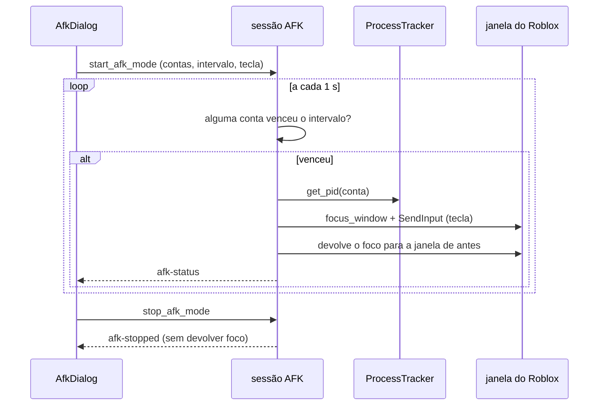

# AFK mode (envio periódico de tecla)

## Objetivo

Mandar **uma tecla, de tempo em tempo**, para a janela do cliente de cada conta que o usuário colocou no modo — para o jogo não contar a conta como parada e **não precisar de rejoin**. O ganho em relação ao Auto Rejoin é o estado: a conta não sai do lugar do mapa, não perde progresso e não reabre cliente nenhum.

**O que não é:** detecção de interação. A API do Windows que diz "quando houve a última entrada" responde pela **sessão inteira** do usuário, nunca por uma janela — não há como perguntar "esta conta está parada?". Por isso o modo é de envio periódico, e só.

**O que o módulo não faz, por regra:** nunca lê o teclado do usuário (nada de gancho global, estado de tecla ou entrada crua), nunca fecha, mata ou minimiza cliente, e nunca envia tecla fora de uma lista fechada.

## Onde fica o código

| Arquivo | Papel |
|---|---|
| [commands/afk.rs](../../src-tauri/src/commands/afk.rs) | Lista fechada de teclas, agendador por conta, sessão (`start_afk_mode`, `stop_afk_mode`, `set_afk_accounts`, `afk_trigger_now`, `get_afk_mode_status`, `get_afk_keys`) |
| [platform/windows/input.rs](../../src-tauri/src/platform/windows/input.rs) | `vk_and_scan` (nome da tecla → virtual key + scan code), `send_key` (`SendInput`), `window_exists` |
| [platform/windows/windowing.rs](../../src-tauri/src/platform/windows/windowing.rs) | `find_main_window`, `focus_window` (restaura só janela **minimizada**), `give_focus_back` (devolve o primeiro plano sem mexer no estado da janela), `get_foreground_hwnd` |
| [platform/windows/tracker.rs](../../src-tauri/src/platform/windows/tracker.rs) | `get_pid(user_id)`: quem diz qual PID é de qual conta |
| [dialogs/AfkDialog.tsx](../../src/components/dialogs/AfkDialog.tsx) | A tela: intervalo, tecla, contas no modo, aviso do foco, ligar/parar |
| [store.tsx](../../src/store.tsx) | `afkStatus`, `afkKeys`, `startAfkMode`, `stopAfkMode`, `setAfkAccounts`, `afkTriggerNow`, eventos `afk-status` / `afk-cycle` / `afk-stopped` |
| [utils/afkBeep.ts](../../src/utils/afkBeep.ts) | O bipe opcional de fim de ciclo, sintetizado por Web Audio (sem arquivo de áudio no repositório) |

## Fluxo

1. A tela lê `Afk.IntervalMinutes` e `Afk.Key` do INI e a **lista de teclas do backend** (`get_afk_keys`). Sem tecla escolhida, o botão de ligar fica desabilitado.
2. `start_afk_mode { userIds, intervalMinutes, key }` valida (tecla da lista + pelo menos uma conta), derruba uma sessão anterior se houver e cria a sessão (`new_afk_session`): cada conta entra com o relógio marcando **agora**, então o primeiro envio dela sai só depois de um intervalo inteiro — e a tela **já sabe** o prazo do primeiro envio (`started_at` + intervalo) antes de qualquer tecla sair.
3. O laço da sessão acorda a cada segundo e pergunta, por conta, "passou um intervalo desde o último envio?" (`afk_due_targets`). Ninguém vencido, nada acontece.
4. Para as contas vencidas, um ciclo roda em thread bloqueante (serializado: nunca dois ciclos ao mesmo tempo):
   1. guarda qual janela estava em primeiro plano;
   2. para cada conta, resolve `PID` no tracker, confere que aquele PID **ainda é um Roblox** e acha a janela principal;
   3. anota se a janela estava minimizada, chama `focus_window` (que só desminimiza: janela maximizada continua maximizada) e espera 150 ms;
   4. **confere que a janela do alvo está de fato em primeiro plano** (`afk_window_is_ready`). Se não está, nada é enviado: a conta recebe o erro `focusDenied` e o ciclo segue;
   5. estando pronta: tecla pressionada → 40 ms → tecla solta (com até três tentativas de soltar) → 250 ms antes da conta seguinte;
   6. janela que estava minimizada volta a ser minimizada;
   7. no fim, devolve o foco para a janela de antes com `give_focus_back` — só o primeiro plano, **sem mexer no estado dela**.
5. O status vai para a tela pelo evento `afk-status` (por conta: último envio, próximo envio, total de envios, último erro **com código**: `noWindow`, `focusDenied`, `keyRefused` ou `internal`). Ciclo com pelo menos um envio também emite `afk-cycle { sent }`, que é o gancho do bipe opcional.
6. `stop_afk_mode` marca a sessão como parando; o ciclo em andamento é abandonado no próximo alvo e o foco **não** é devolvido. Depois de 2 s de espera a sessão é descartada de qualquer jeito, e o evento `afk-stopped` sai.

## Regras de negócio

- **Lista fechada de teclas:** `Space`, `W`, `A`, `S`, `D`, `E`, `F`, `R`, `Q`, `1`–`5`. Não existe campo para digitar tecla: a tela oferece o que `get_afk_keys` devolveu, e `afk_virtual_key` recusa qualquer outro nome (é esse `None` que impede a tecla de chegar ao `SendInput`). Ficaram fora de propósito Enter (abre o chat), Tab (troca de janela), Escape (menu do Roblox) e F4 (fecha o cliente junto com Alt).
- **Sem tecla escolhida o modo não liga.** Não há tecla padrão: uma tecla escolhida pelo app mexeria no personagem sem o usuário ter pedido.
- **A tecla só sai depois de confirmar que a janela do alvo está em primeiro plano.** Este é o ponto mais importante da funcionalidade. O `SendInput` entrega na janela em primeiro plano, e o Windows **recusa** `SetForegroundWindow` de processo que não está em primeiro plano nem recebeu o último evento de entrada — que é exatamente o caso do AFK mode enquanto o usuário trabalha em outro programa. Sem a conferência, a tecla ia **todo ciclo** para a janela em que ele está digitando, e o ciclo se declarava bem-sucedido. Agora: retorno do `focus_window` + `get_foreground_hwnd() == alvo`; se não bate, **nada é enviado**, a conta fica com `focusDenied` e a tela diz qual conta foi pulada e por quê.
- **Consequência honesta:** o envio automático depende de o Windows permitir a troca de janela. Quando ele não permite, o modo fica pulando ciclos (visível na tela) em vez de teclar na janela errada. O **envio manual** ("Enviar a tecla agora") passa porque o usuário acabou de clicar na janela do app, e o ciclo seguinte também passa quando o gerenciador é a janela em uso. Devolver o foco no fim é melhor esforço: o Windows pode recusar isso também, e aí a janela do Roblox fica na frente.
- **Janela que o usuário tinha minimizado volta a ser minimizada.** Trazer para frente desminimiza (`focus_window` faz `SW_RESTORE` em janela minimizada); quem lança com "minimizar depois do launch" e trabalha com os clientes minimizados não pediu para vê-los na tela. Só vale para janela de conta **no modo**, e só para quem já estava minimizado.
- **Janela maximizada continua maximizada — a do cliente e a do usuário.** `SW_RESTORE` só com a janela minimizada (`IsIconic`): numa janela maximizada ele a devolve ao tamanho normal. Aplicado sempre, o ciclo tirava do maximizado o cliente alvo e, ao devolver o foco, **a janela em que o usuário estava trabalhando**, a cada ciclo — inclusive quando o foco tinha sido negado e nada foi enviado. Devolver o foco é `give_focus_back`: só `SetForegroundWindow`, sem `ShowWindow` nenhum.
- **Soltar a tecla é tentado até três vezes.** Tecla que fica logicamente pressionada no cliente faz o personagem andar — o oposto do que a funcionalidade existe para fazer.
- **O foco sai da janela do usuário a cada envio**, por cerca de 150 ms + 40 ms por conta no modo (mais 250 ms de respiro entre contas), e volta no fim do ciclo. É o preço do `SendInput`, que só alcança a janela em **primeiro plano**; `PostMessage` não move o personagem. A tela diz isso com essas palavras, inclusive que uma tecla pode cair na janela errada se o usuário estiver digitando em outro programa naquele instante.
- **Só conta que está no modo é alvo.** O alvo sai do mapa da sessão; conta fora dele não tem entrada e nunca vira alvo, por mais tempo que passe. E só clientes que **este app** abriu são alcançáveis, porque é o tracker que liga conta a PID.
- **PID reaproveitado não recebe tecla:** antes de enviar, o ciclo confere que o PID rastreado ainda está na lista de processos do Roblox (o Windows reaproveita PID de processo morto).
- **Janela que fechou no meio do ciclo é pulada** — sem enviar nada e sem mexer em janela de ninguém. A conta continua no modo, registra o motivo em `lastError` e é tentada de novo no intervalo seguinte.
- **Parar interrompe na hora**, inclusive um ciclo em andamento: o `stop_flag` é conferido antes de cada alvo. Quem está parando **não devolve o foco** (o usuário já pode ter clicado em outra janela), e sessão parada à força é descartada para não ficar no caminho da próxima.
- **Uma tentativa consome o intervalo:** conta visitada pelo ciclo (com envio ou pulada) tem o relógio remarcado, então o laço não fica girando em cima de uma conta sem cliente. Conta que o ciclo **não** alcançou (parada no meio) continua vencida.
- **Nada aqui fecha, mata ou minimiza cliente**, nem da conta no modo, nem de outra conta (Global Constraint do launch). Tirar uma conta do modo só para de mandar tecla para ela.
- Lista de contas vazia em `set_afk_accounts` desliga a sessão (modo sem conta não faz nada).
- O intervalo é travado em 1–120 minutos; o valor fica em `Afk.IntervalMinutes`, e a tecla escolhida em `Afk.Key`.
- **A tela sabe o prazo do primeiro envio na hora em que a sessão liga.** Sem isso, quem liga o modo com 10 minutos de intervalo passa 10 minutos olhando um `--` sem saber se pegou — foi o defeito que o projeto de origem teve (commit `1da709b` dele) e que o teste `the_first_deadline_is_known_the_moment_the_session_starts` impede aqui.
- **"Enviar a tecla agora"** (`afk_trigger_now`) faz um ciclo na hora, e **exige sessão**: as contas pedidas são interseccionadas com o mapa da sessão (`afk_manual_targets`), porque nem trazer para frente é permitido em cliente de conta fora do modo. Sem sessão o comando recusa, e o botão fica indisponível na tela. Valida a mesma lista de teclas e remarca o relógio das contas visitadas (senão o envio manual seria seguido de outro logo depois).
- **Um ciclo por vez, mesmo com parada no meio.** O `AFK_CYCLE_LOCK` (assíncrono) serializa o agendador e o envio manual; o `AFK_CYCLE_SEQ` (bloqueante, dentro do corpo do ciclo) existe porque `JoinHandle::abort` **não** interrompe uma closure de `spawn_blocking` que já começou — sem ele, o timeout de 2 s do "parar" liberava o lock assíncrono com o corpo antigo ainda rodando.
- **O relógio de cada conta é marcado com o instante em que o ciclo começou**, não com o instante em que ele terminou: lido depois, o relógio escorregava a duração do ciclo a cada volta e o intervalo efetivo crescia com o número de contas.
- **Bipe opcional de fim de ciclo** (`Afk.BeepOnCycle`, default **desligado**): som curto sintetizado por Web Audio quando um ciclo mandou tecla. Existe porque o usuário está usando o PC e o piscar de foco fica sem explicação; não há arquivo de áudio no repositório de propósito (asset novo tem licença para rastrear, e um bipe de 120 ms não justifica). Sem Web Audio na janela, o modo segue funcionando sem som.
- **O relógio da tela não depende de "está rodando".** O tique de 1 s roda enquanto o diálogo está aberto: amarrá-lo ao `active` congelava o tempo decorrido nas janelas em que a sessão existe mas a tela ainda não recebeu o status novo.
- **Config de sessão em andamento é derivada da sessão**, nunca copiada para o estado da tela: o efeito que relê o INI ao abrir corria contra a cópia e zerava a tecla escolhida (o botão de enviar ficava desabilitado com a sessão rodando).

## Configurações relacionadas

| Chave | Default | Significado |
|---|---|---|
| `Afk.IntervalMinutes` | `10` | Minutos entre dois envios da **mesma** conta (1–120). |
| `Afk.Key` | `""` | Tecla escolhida pelo usuário, de dentro da lista fechada. Vazio = o modo não liga (chave vazia não é gravada no INI). |
| `Afk.BeepOnCycle` | `false` | Bipe curto quando um ciclo manda tecla. |

Constantes do ciclo, no código (não são configuráveis): 150 ms de folga depois de trazer a janela para frente, 40 ms de tecla pressionada, 250 ms entre duas contas, e 1 s de tique do agendador. O respiro entre duas contas existe pelo mesmo motivo do `inter_window_delay_ms` do projeto de origem — mandar tecla para várias janelas em sequência sem folga não funciona bem —, mas aqui é constante: não há caso conhecido que peça outro valor, e cada chave de settings nova custa aba, documentação e espelho de defaults.

## Armadilhas / cuidados

- **Não trocar `SendInput` por `PostMessage`/`SendMessage` "para não roubar o foco":** o cliente do Roblox lê teclado pelo caminho de entrada do sistema e ignora mensagem postada na fila da janela. O envio sem foco simplesmente não funciona, e o modo passaria a mentir.
- **Não "consertar" o `SetForegroundWindow` recusado com `AttachThreadInput`** (nem com hook, nem mexendo no `ForegroundLockTimeout` do sistema). O caminho aqui é **não enviar** e dizer na tela; anexar fila de entrada de outra thread é leitura/injeção que este módulo não faz, e `AttachThreadInput` está na lista de proibições do `afk_input_safety_tests` — inclusive dentro de `platform/windows/windowing.rs`, onde mora o `focus_window`.
- **A identidade do alvo é só o PID.** O tracker guarda `user_id → pid` e não guarda o instante de início do processo. Se o cliente da conta A morrer e o Windows reaproveitar o PID para o cliente de B antes do `cleanup_dead_processes` passar, o AFK mode foca e tecla a janela de **B**. É desenho pré-existente do tracker (o mesmo risco que `kill_for_user` mitiga só checando "ainda é um Roblox"), mas o AFK mode é a primeira funcionalidade que **injeta entrada** com base nele — fechar isso de verdade pede start time no tracker.
- **Não acrescentar tecla na lista sem pensar no que ela faz no jogo.** A lista é fechada por segurança e por previsibilidade; teclas que abrem chat, trocam de janela ou fecham o cliente ficam fora.
- **Nada de leitura de teclado, e nada de injeção fora da lista fechada.** O `afk_input_safety_tests` (em `commands/afk.rs`) **caminha por `src-tauri/src` inteiro**, trata como arquivo do AFK mode todo caminho que cite `afk`, todo arquivo que chame `SendInput` (arquivo novo entra na varredura sozinho) **e todo fragmento `include!()` do mesmo módulo que um deles** — `include!()` não cria módulo: os `platform/windows/*.rs` são um módulo só, `windows`, e os `commands/*.rs` são pedaços da raiz do crate; fragmento irmão se chama sem caminho nenhum, então não há fronteira a vigiar entre eles —, tira os módulos de teste contando chaves (código de produção escrito **depois** dos testes continua varrido) e reprova: gancho global (`SetWindowsHookEx`, `SetWinEventHook`), estado de tecla (`GetAsyncKeyState`, `GetKeyState`, `GetKeyboardState`), entrada crua (`GetRawInputData`, `GetRawInputBuffer`, `RegisterRawInputDevices`), tradução de tecla para caractere e nome de tecla (`ToUnicode*`, `ToAscii*`, `GetKeyNameText`), fila de entrada de outra thread (`AttachThreadInput`, `GetGUIThreadInfo`), `GetLastInputInfo`, e injeção fora da lista (`keybd_event`, `mouse_event`, `INPUT_MOUSE`, `KEYEVENTF_UNICODE`). Também reprova **alcance indireto**: nenhum arquivo do AFK mode pode chegar a um módulo do backend que leia entrada (hoje o `webview_recovery`, que usa `GetAsyncKeyState` legitimamente), e o nome que conta é o do **módulo**, não o do fragmento: um `windowing.rs` que lesse entrada faz do `windows` inteiro um leitor, e é `windows::` que o `commands/afk.rs` escreve. Antes disso a varredura tratava cada arquivo como módulo, e um `AttachThreadInput` dentro de `windowing.rs` (o "conserto" clássico do foco negado) passava com a suíte verde. Leitura de entrada que outra funcionalidade precise vai para um módulo próprio, como o `webview_recovery`: num fragmento da raiz do crate ou do `windows` ela reprova a varredura. Comentário que **cite** essas APIs no corpo de um arquivo do AFK mode reprova junto — é de propósito; explique-as no módulo de teste ou aqui.
- **O caminho até o `SendInput` é um só, e um teste conta os call sites.** `send_key` é privado de `platform/windows/input.rs` e a única porta pública é `tap_afk_key(nome_da_tecla)`, que resolve o nome pela lista fechada — não existe chamador com virtual key cru. `only_the_input_module_sends_input` reprova se `SendInput(`/`send_key(` aparecer em outro arquivo.
- **Intervalo curto rouba o foco com frequência.** O piso é 1 minuto, mas quem usa o PC ao mesmo tempo sente; o default de 10 minutos existe para ficar abaixo do tempo típico de AFK do Roblox sem incomodar.
- O AFK mode é **Windows-only**; nas outras plataformas os comandos devolvem erro.
- Fora de escopo, de propósito: expor o AFK mode ao script API e qualquer forma de detecção de interação.

## Testes

Suíte `afk` (`bun run t afk`):

- `afk_command_tests` — lista fechada de teclas (e recusa de tecla fora dela), recusa de start sem tecla/sem conta, clamp do intervalo, "está na hora desta conta?" a partir de (último envio, intervalo, agora), alvos do ciclo (incluindo "conta fora do modo nunca é alvo"), e as decisões de parada (ciclo abandonado e foco não devolvido).
- `afk_input_safety_tests` — a trava contra ler teclado e injetar fora da lista: varredura do backend inteiro, fragmento `include!()` tratado como o módulo que o inclui (`a_fragment_that_reads_input_makes_the_module_that_includes_it_a_reader`, `every_fragment_of_a_module_with_afk_code_is_scanned`), remoção dos módulos de teste por contagem de chaves (com marcador de fim de arquivo provando que produção depois dos testes é varrida), alcance indireto e call sites do `SendInput`.
- `win_input_tests` — tradução de nome de tecla para virtual key + scan code, e janela nula nunca "existe".
- `win_focus_tests` (em `platform/windows/windowing.rs`) — `SW_RESTORE` só em janela minimizada (`a_maximized_or_normal_window_comes_to_the_front_as_it_is`) e devolver o foco nunca mexe no estado da janela (`giving_the_focus_back_never_changes_the_window_state`); o `afk_command_tests::the_cycle_gives_the_focus_back_without_touching_the_window_state` confere que o ciclo devolve o foco por esse caminho, e não pelo `focus_window`.
- Foco: `a_window_that_did_not_reach_the_foreground_is_not_ready`, `a_window_in_the_foreground_is_ready_for_the_key`, `a_null_target_is_never_ready`; re-minimizar: `a_window_the_user_had_minimized_goes_back_to_minimized`; envio manual: `a_manual_send_only_reaches_accounts_that_are_in_afk_mode`; código de erro: `every_send_error_carries_a_code_and_a_message`, `the_status_tells_the_screen_which_error_it_was`.
- `AfkDialog.test.tsx` — o aviso do foco na tela, só as teclas do backend, start bloqueado sem tecla/sem conta, parar sem fechar cliente, tempo decorrido (`<1m`, `12m`, `1h 5m`), "enviar agora" e o bipe nascendo desligado.
- `afkBeep.test.ts` — o bipe toca um oscilador curto de volume baixo, fecha o contexto no fim e nunca lança sem Web Audio.

`SendInput`, foco e janela de verdade ficam fora de teste: precisam de um cliente Roblox aberto.
