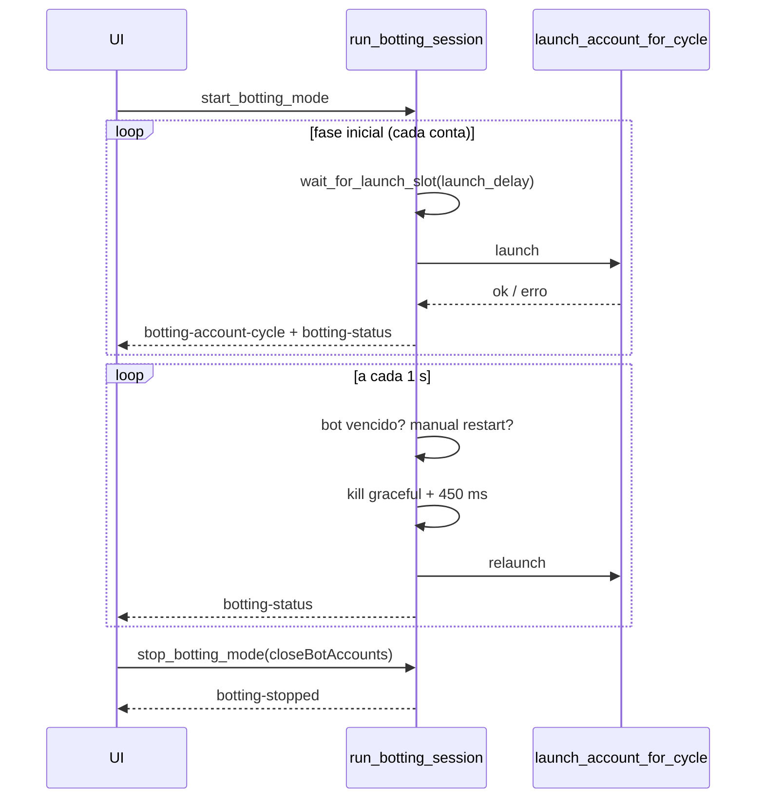

# Auto Rejoin

**Na interface a funcionalidade se chama Auto Rejoin; por dentro ela continua `botting`.** O nome interno é intencional e não se mexe nele: chave do `RAMSettings.ini` (`Botting*`, `BottingPlayer*`, `BottingBot*`), nome de comando Tauri, de evento, de campo de JSON, de arquivo, de módulo, de função e de teste. Renomear qualquer uma dessas chaves apagaria a configuração de quem já usa o app. Os papéis seguem a mesma regra: a tela diz **main** e **alt**, o código diz `player` e `bot` (`player_user_ids`, `BottingPlayer*`/`BottingBot*`). A fronteira é coberta por teste — `auto_rejoin_naming_tests` (aqui) e a varredura em [locales.test.ts](../../src/i18n/locales.test.ts) reprovam se o nome antigo voltar a aparecer na tela.

## Objetivo

Manter um grupo de contas **alt** dentro de um place, **relançando cada alt periodicamente** (a cada `interval_minutes`) e reagindo a falhas com backoff, enquanto contas marcadas como **main** são lançadas uma vez e nunca reiniciadas pelo timer. Exclusivo de Windows.

Quando o objetivo é só **não perder o estado** da conta (não sair do lugar do mapa, não precisar de rejoin), o caminho é o [AFK mode](afk-mode.md): ele manda uma tecla de tempo em tempo para a janela da conta em vez de relançar o cliente.

## Onde fica o código

| Arquivo | Papel |
|---|---|
| [botting.rs](../../src-tauri/src/commands/botting.rs) | `launch_account_for_cycle`, `run_botting_session` (loop), comandos `start_botting_mode`, `stop_botting_mode`, `get_botting_mode_status`, `add_botting_accounts`, `set_botting_player_accounts`, `botting_account_action` |
| [launch_shared.rs](../../src-tauri/src/commands/launch_shared.rs) | Tipos `BottingConfig`, `BottingAccountRuntime`, `BottingSession`, `BOTTING_MANAGER`; `backoff_delay_seconds`, `wait_for_launch_slot`, `is_429_related_error`, `detect_auth_failure_window`, `LaunchClientProfile`, `botting_uses_shared_client_profile`, `emit_botting_status` |
| [platform/windows/optimization.rs](../../src-tauri/src/platform/windows/optimization.rs) | Perfis de processo (prioridade, background mode, EcoQoS, memory priority, job CPU/memória, fast flags allowlist) |
| [store.tsx](../../src/store.tsx), [BottingDialog.tsx](../../src/components/dialogs/BottingDialog.tsx) | UI, rascunho de configuração, status |

## Fluxo

1. `start_botting_mode(userIds, placeId, jobId, launchData, playerUserIds, intervalMinutes, launchDelaySeconds, playerGraceMinutes)` valida, cria a sessão (substituindo uma anterior: sinaliza stop e aguarda até 2 s) e faz `tokio::spawn(run_botting_session)`.
2. **Fase inicial:** percorre `user_ids` na ordem; para cada conta não desconectada e fora de cooldown 429: `wait_for_launch_slot` (garante `launch_delay_seconds` desde o último launch) → `launch_account_for_cycle`.
   - Sucesso player → `running-player`, sem próximo restart.
   - Sucesso bot → `running`, `next_restart_at_ms = agora + interval`.
   - Falha → `retry-backoff`, `retry_count++`, `next_restart_at_ms = agora + backoff`.
3. **Loop principal** (a cada 1 s): para cada conta decide se relança:
   - `disconnected` → nunca relança (`disconnected` / `disconnected-running`);
   - `manual_restart_pending` → relança quando `next_restart_at_ms` vence;
   - player → só atualiza fase (`running-player` / `queued-player`), nunca relança;
   - bot com `next_restart_at_ms` vencido → relança;
   - bot sem agendamento → agenda `agora + interval`.
4. Relançar = `wait_for_launch_slot` → `kill_for_user_graceful_async(uid, 4500)` → 450 ms → `launch_account_for_cycle`.
5. Cada ciclo emite `botting-account-cycle {userId, ok, error}` e `botting-status` (payload completo).
6. **Console:** o mesmo helper (`emit_botting_cycle`) que emite o evento escreve a linha no console — as duas passagens (fila inicial e laço) passam por ele, senão uma ficaria sem histórico. Também viram linha: início e fim da sessão (`emit_session_log`, `userId` nulo), cada reinício com o **número de reinícios da conta nesta sessão**, o rate limit com o tempo de espera, e a falha em fechar o cliente anterior. A origem que o console desenha é `[rejoin]` (e `[rejoin-retry]` nas tentativas) — nome curto de propósito: a coluna do chip tem largura fixa medida no nome mais longo. Antes disso o Auto Rejoin não deixava rastro nenhum no console.
6. Ao parar: limpa a sessão (se ainda for a mesma), `notify_waiters`, emite `botting-stopped`.

`launch_account_for_cycle` (por conta):
1. Escolhe o perfil: `Normal` se `BottingUseSharedClientProfile` (default `true`), senão `BottingPlayer` ou `BottingBot`.
2. Multi Roblox, `refresh_production_version().await` + patch de client settings do perfil **na pasta que `resolve_botting_base_path` decide** (a versão da conta já foi resolvida a esta altura — a regra está no passo 4), fecha instância anterior se `AutoCloseLastProcess`.
3. Auth ticket com até 5 tentativas; só re-tenta em erro 429/"authentication failed", esperando 4 s, 8 s, 12 s, 16 s.
4. Resolve a versão da conta (`RobloxVersion`, mesma precedência do launch — ver [roblox-versions.md](roblox-versions.md)) via `resolve_roblox_install_path`; qualquer versão resolvida força old join (`resolve_use_old_join`). Spawn: old join na pasta resolvida (ou `default_player_dir` — a build do canal **lido** do registro — quando não há versão resolvida) via `launch_old_join_from`; ou protocolo via `launch_url`, que **sempre** abre a build de produção (`channel:` vazio vence o registro — `CLAUDE.md`). `resolve_botting_base_path` decide a pasta do patch de client settings com a mesma regra. Espera PID 12 s (timeout = erro).
5. `track_with_version` (a versão só é reportada no ramo old join — `botting_tracked_version` — senão o tracker mentiria para a guarda de conflito da fila de launch, já que o protocolo sempre abre produção) + `apply_windows_post_launch_profile(profile)`.
6. `detect_auth_failure_window`: por ~8 s (20 × 400 ms) olha o título da janela; se indicar "authentication failed"/"error code: 429" → mata o cliente e retorna erro 429.
7. Minimiza se `…StartRobloxMinimized` do perfil.

## Regras de negócio

- **Adotar contas que já estão em jogo** (`adoptRunning`): o Start normal **fecha e relança** cada conta na primeira passagem — ligar o ciclo em contas que já estavam jogando derrubava todas elas. Com a adoção, quem já tem cliente aberto não é tocado: entra no ciclo valendo um intervalo inteiro a partir de agora, e o primeiro reinício acontece no vencimento. Decidido em `botting_first_pass` (adota / lança / pula desconectada), com teste.
  - O gesto está no **Painel de Sessão**, seção "In game": o botão `Auto Rejoin` age nas contas marcadas ou, sem marcação, em todas as que estão rodando. Com sessão ativa ele usa `add_botting_accounts` (que já adotava sem relançar); sem sessão, cria uma.
  - **O place vem da presença da conta** (`get_account_game_location`, presença autenticada), não do campo da tela: com o place errado, o primeiro reinício jogaria a conta em outro jogo. Essa leitura **não** passa por `run_with_session_retry` — o refresh derruba as sessões abertas, que são justamente os clientes que se quer preservar. Sem descobrir o place, o app avisa em vez de chutar.
  - O **job id não é fixado** na sessão: o ciclo relança no place, e prender o servidor atual mandaria todo reinício para um servidor que pode não existir mais.
  - Continua valendo o mínimo de **duas contas** para abrir uma sessão; com uma só, a mensagem diz isso em vez de deixar o backend recusar.
- **Abertura com jogo escolhido:** o diálogo aceita `initialPlaceId` (`store.openBottingDialog(placeId)`), usado pelo clique direito num jogo nas listas da Choose Game. Esse place **vence** o rascunho `General.BottingDraftPlaceId`, que por sua vez vence a store — sem essa precedência, escolher o jogo no menu e ver outro place no diálogo. Abrir sem jogo (barra de ações, toolbar, sidebar) limpa o jogo da abertura anterior.
- **Pré-requisitos:** pelo menos 2 contas únicas; `placeId > 0`; `EnableMultiRbx` ligado; as contas main precisam estar entre as selecionadas.
- **Limites (clamp):** `interval_minutes` 10–480; `launch_delay_seconds` 5–120; `player_grace_minutes` 1–90 (≤ 0 usa `BottingPlayerGraceMinutes`, default 15); `BottingRetryMax` 1–20 (default 6); `BottingRetryBaseSeconds` 5–120 (default 8).
- **Backoff:** `base × 2^(min(retry_count-1, retry_max, 12))`, limitado a 5–300 s.
- **429:** delay = `max(backoff, 45 s, 2 × launch_delay)` e a conta entra em cooldown (pulada até vencer, fase `retry-backoff`).
- **Falha ao fechar o cliente anterior:** `retry-backoff` com `max(backoff, 2 × launch_delay)` limitado a 6–300 s e erro "Previous Roblox instance did not close before relaunch (pid N)".
- **Papéis:**
  - *Main* (`player` no código e nas chaves do INI): lançada uma vez, nunca reiniciada pelo timer, não pode ser desconectada.
  - *Alt* (`bot` no código): reiniciada a cada `interval_minutes` após o último launch bem-sucedido.
  - `set_botting_player_accounts`: promovida a main → limpa agendamento (`running-player`/`queued-player`). Rebaixado com cliente aberto → `player-grace` e restart após `player_grace_minutes`; sem cliente → `queued` imediato.
- **"Exemptions" = estado `disconnected`:** não há campo "exempt" no código; excluir uma conta do auto-rejoin é feito via `botting_account_action`:
  - `disconnect` → para de relançar (mantém cliente aberto: `disconnected-running`);
  - `close` → mata o cliente; se estava desconectado, volta ao loop com restart imediato; senão mantém/agenda o próximo restart (`waiting-rejoin` / `queued`);
  - `closeDisconnect` → mata e desconecta;
  - `restartClient` → mata e relança já, **preservando** o horário do próximo restart agendado (bots);
  - `restartLoop` → mata e relança já, reiniciando o ciclo.
- **`add_botting_accounts`:** contas precisam existir no store e não estar na sessão; com cliente aberto → `running` com restart em `interval`; sem cliente → `queued` com launch em `launch_delay`. Entram sempre como alt.
- **`stop_botting_mode(closeBotAccounts)`:** sinaliza stop; com `closeBotAccounts = true` fecha **somente as alts desta sessão** (`cfg.user_ids` menos `player_user_ids`) via `tracker.kill_for_user` e depois `cleanup_dead_processes`. As mains e os clientes abertos fora da sessão nunca são fechados (antes era `kill_all_roblox_except`, que derrubava qualquer cliente não-player).
- **Fases possíveis:** `queued`, `queued-player`, `launching`, `running`, `running-player`, `restarting`, `retry-backoff`, `waiting-rejoin`, `player-grace`, `disconnected`, `disconnected-running`.

### Modos de background (seção Optimization)

Aplicados por `apply_windows_post_launch_profile` ao PID após o launch (só se `EnableProcessPolicy` ou algum limite de job estiver ligado), depois de `ProcessPolicyDelayMs`:

- `PriorityClass` (`normal` / `below_normal` / `idle`); `BackgroundMode = true` força `IDLE_PRIORITY_CLASS`.
- `EcoQos` → power throttling `EXECUTION_SPEED`; `IgnoreTimerResolution` → `IGNORE_TIMER_RESOLUTION`.
- `MemoryPriority` (`normal` / `low` / `very_low`).
- Experimental: `EnableJobCpuLimit` + `JobCpuLimitPercent` (5–100, hard cap via Job Object); `EnableJobMemoryLimit` + `JobMemoryLimitMb` (256–32768, **o processo é encerrado pelo Windows se passar**); `EnableFastFlags` + `FastFlagsJson` (só chaves da `WINDOWS_FASTFLAG_ALLOWLIST`).
- Falha ao aplicar → evento `roblox-optimization-warning {pid, message}`.
- Defaults do perfil `BottingBot`: `below_normal`, `BackgroundMode=true`, `EcoQos=true`, `IgnoreTimerResolution=true`, `MemoryPriority=low` (mas `EnableProcessPolicy=false`, então nada é aplicado até ligar).

## Configurações relacionadas

| Seção | Chave | Default | Efeito |
|---|---|---|---|
| General | `EnableMultiRbx` | — | Obrigatório |
| General | `BottingUseSharedClientProfile` | `true` | Usa o perfil `Normal` para todos (ignora os perfis Main/Alt) |
| General | `BottingDefaultIntervalMinutes` | `19` | Valor inicial do diálogo |
| General | `BottingLaunchDelaySeconds` | `20` | Valor inicial do diálogo |
| General | `BottingRetryMax` / `BottingRetryBaseSeconds` | `6` / `8` | Backoff |
| General | `BottingPlayerGraceMinutes` | `15` | Carência ao rebaixar uma main |
| General | `BottingPlayer*` / `BottingBot*` (`UnlockFPS`, `MaxFPSValue`, `CustomClientSettings`, `OverrideClientVolume`, `ClientVolume`, `OverrideClientGraphics`, `ClientGraphicsLevel`, `OverrideClientWindowSize`, `ClientWindowWidth/Height`, `StartRobloxMinimized`) | ver store | Client settings por papel (só com perfil não compartilhado) |
| General | `BottingDraft*` | vazio | Rascunho do diálogo (frontend) |
| Optimization | `{Normal,BottingPlayer,BottingBot}{EnableProcessPolicy, ProcessPolicyDelayMs, PriorityClass, BackgroundMode, EcoQos, IgnoreTimerResolution, MemoryPriority, EnableFastFlags, FastFlagsJson, EnableJobCpuLimit, JobCpuLimitPercent, EnableJobMemoryLimit, JobMemoryLimitMb}` | ver [store.rs](../../src-tauri/src/data/settings/store.rs) | Políticas de processo pós-launch |
| Developer | `UseOldJoin`, `IsTeleport` | `false` | Iguais ao launch |
| General | `AutoCloseLastProcess`, `AutoCloseRobloxForMultiRbx` | `false` | Iguais ao launch |

## Armadilhas / cuidados

- O botting resolve a versão configurada da conta (`RobloxVersion`/`DefaultVersion`/catálogo, via `resolve_roblox_install_path`) e agora **reporta essa versão ao `ProcessTracker`** (`track_with_version`, via `botting_tracked_version`) — sem isso, `has_version_conflict` (a guarda que a fila de launch usa antes de abrir uma conta) não enxergava os clientes do Auto Rejoin, e um launch avulso numa versão diferente da do Auto Rejoin passava sem aviso. O Auto Rejoin em si **não roda isolamento** e **não checa conflito de versão antes de lançar** — ele só alimenta a guarda que a fila de launch já tem; não existe checagem simétrica no sentido Auto Rejoin-vê-fila. Old join usa a pasta resolvida (ou `default_player_dir` — build do canal lido do registro — quando não há versão resolvida); o protocolo (`launch_url`) sempre abre a build de **produção**, porque o `channel:` vazio da URL vence o registro (que esse caminho nem lê) — nesse ramo a versão reportada ao tracker é sempre `None` (ver as regras críticas do `CLAUDE.md` e [launch.md](launch.md#canal-do-roblox-e-a-tela-de-atualização-causa-raiz-e-fix)).
- `kill_for_user` só mata se o PID rastreado ainda for Roblox; se o cliente de uma alt já tinha fechado e o PID foi reutilizado, o stop apenas remove do tracker.
- Com `BottingUseSharedClientProfile = true` (default), as chaves `BottingPlayer*`/`BottingBot*` de General e de Optimization são ignoradas.
- Limite de memória por Job Object mata o cliente ao estourar — combine com cuidado com o intervalo de rejoin.
- O stop não espera o launch em andamento terminar; o loop só percebe a flag entre etapas.
- Estado da sessão é só em memória: fechar o app perde a sessão.
