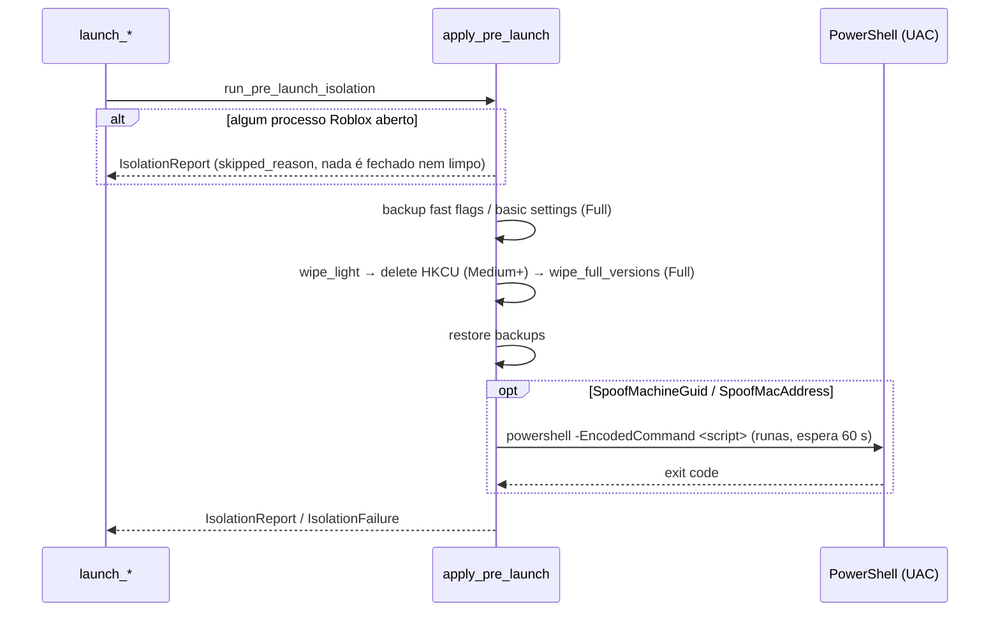

# Isolamento pré-launch

## Objetivo

Antes de lançar, apagar rastros locais do Roblox (cache, logs, prefetch, registro, instalações) e opcionalmente rotacionar identificadores de máquina (MachineGuid, MAC) para que contas diferentes não compartilhem sessão/cache/fingerprint. Exclusivo de Windows.

## Onde fica o código

| Arquivo | Papel |
|---|---|
| [commands/isolation.rs](../../src-tauri/src/commands/isolation.rs) | `run_pre_launch_isolation` (chamado pelo launch), `apply_pending_fast_flags_when_ready`, comandos `isolation_get_status`, `isolation_save`, `isolation_list_adapters`, `isolation_restore_network_identifiers`, `isolation_dry_run` |
| [platform/windows/isolation.rs](../../src-tauri/src/platform/windows/isolation.rs) | `IsolationMode`, `apply_pre_launch`, `dry_run`, rotinas de wipe, backup/restore de fast flags e `GlobalBasicSettings_13.xml`, geração de GUID/MAC, script PowerShell elevado |
| [launch.rs](../../src-tauri/src/commands/launch.rs) | Chama o isolamento em `launch_roblox` e `launch_multiple` |

## Fluxo

1. `launch_roblox` / `launch_multiple` chamam `run_pre_launch_isolation`. Se `does_anything()` é falso (`Mode = Off` e sem spoof) → nada acontece.
2. `apply_pre_launch` roda em `spawn_blocking`, emitindo `isolation-progress {stage, message, pathsCleaned, bytesFreed, finished}`:
   1. `starting`.
   2. Verificação de clientes abertos (`find_roblox_pids_all`): se houver qualquer `RobloxPlayerBeta.exe`, `RobloxPlayerLauncher.exe` ou `RobloxCrashHandler.exe` rodando, **nada é fechado**: grava `skipped_reason` ("N Roblox process(es) already running. Isolation skipped so the open clients are not closed."), emite `skipped` (com `finished = true`) e retorna o relatório sem limpar nem fazer spoof. O launch continua normalmente.
   3. `preserving` (só Full): backup de fast flags e de `GlobalBasicSettings_13.xml` (conforme opções).
   4. `wiping-cache` (Light/Medium/Full), `wiping-registry` (Medium/Full), `wiping-versions` (Full).
   5. `restoring`: grava backups de fast flags e o XML de basic settings.
   6. Spoof (se habilitado): captura valores atuais, gera novos, `requesting-elevation` → PowerShell elevado (UAC) → `spoof-applied` ou `spoof-failed`.
   7. `finished` ("Cleaned N path(s), freed X MB").
3. Sucesso → grava backups de GUID/MAC no INI (só se ainda vazios) e o launch emite `isolation-report`. Falha → grava o que foi capturado (`partial`) e o launch é abortado com o erro.
4. Se ficou `PendingFastFlags.json`, o launch agenda `apply_pending_fast_flags_when_ready(240 s)`: a cada 2 s procura a pasta mais recente em `%LOCALAPPDATA%\Roblox\Versions` com `RobloxPlayerBeta.exe` e copia o JSON para `ClientSettings\ClientAppSettings.json`.

## O que cada modo apaga

| Modo | Apaga |
|---|---|
| **Off** | Nada (spoof ainda pode rodar se habilitado) |
| **Light** | `%APPDATA%\Roblox\http`, `%APPDATA%\Roblox\logs`; tudo em `%TEMP%` que começa com `Roblox`; `%SystemRoot%\Prefetch\ROBLOXPLAYERBETA.EXE-*` e `ROBLOXCRASHHANDLER.EXE-*` |
| **Medium** | Light + chave de registro **`HKCU\Software\ROBLOX Corporation`** inteira (`RegDeleteTreeW`) |
| **Full** | Medium + `%LOCALAPPDATA%\Roblox\Downloads`, `%LOCALAPPDATA%\Roblox\Logs`; cada subpasta de **`%LOCALAPPDATA%\Roblox\Versions`**, `%ProgramFiles%\Roblox\Versions`, `%ProgramFiles(x86)%\Roblox\Versions`; `%PROGRAMDATA%\Roblox`; para `Bloxstrap`, `Fishstrap`, `Voidstrap` em `%LOCALAPPDATA%`: `Logs`, `Downloads` e cada subpasta de `Versions` |

Exceções no Full:
- Pastas sob `%LOCALAPPDATA%\Roblox Account Manager\RobloxVersions` (versões do catálogo do app) nunca são apagadas.
- Pastas com `RobloxStudioBeta.exe` são mantidas, a menos que `IncludeStudio = true`.

> **ATENÇÃO**
> - **Medium e Full apagam `HKCU\Software\ROBLOX Corporation`** — isso inclui o canal do player (`Environments\RobloxPlayer\Channel`) e demais estados do cliente.
> - **Full apaga as pastas `Versions`**, o que **força reinstalação do Roblox** no próximo launch. O instalador do Roblox fecha todos os `RobloxPlayerBeta.exe` em execução.
> - O isolamento **nunca fecha clientes abertos**: se houver qualquer processo Roblox rodando, ele é pulado inteiro (inclusive o spoof). Só roda de fato quando nenhum Roblox está aberto (ex.: primeira conta de uma sessão).
> Por isso, com Full e sem versão do catálogo, o launch força modo protocolo (não old join) e espera o PID por até 180 s.

## Regras de negócio

- **Fast flags (`PreserveFastFlags`, default `true`, só no Full):** antes do wipe lê `ClientSettings\ClientAppSettings.json` de cada pasta em `%LOCALAPPDATA%\Roblox\Versions` (exceto as gerenciadas pelo app). Depois grava cópias em `%LOCALAPPDATA%\Roblox Account Manager\IsolationBackup\<pasta>-ClientAppSettings.json` e o mais recente em `IsolationBackup\PendingFastFlags.json`, aplicado quando a nova instalação aparecer (e então o pending é removido).
- **Basic settings (`PreserveBasicSettings`, default `true`, só no Full):** `%LOCALAPPDATA%\Roblox\GlobalBasicSettings_13.xml` é lido antes e regravado depois.
- **Spoof MachineGuid:** novo GUID v4 aleatório (`BCryptGenRandom`), escrito em `HKLM\SOFTWARE\Microsoft\Cryptography\MachineGuid` via script elevado. Valor original capturado em `Isolation.BackupMachineGuid`.
- **Spoof MAC:** adaptador escolhido por `TargetAdapter` (subkey de 4 dígitos, descrição ou `NetCfgInstanceId`); sem preferência, o primeiro sem "virtual"/"loopback" na descrição. Novo MAC aleatório localmente administrado (bit `0x02`, unicast). Script grava `NetworkAddress` em `HKLM\SYSTEM\CurrentControlSet\Control\Class\{4D36E972-E325-11CE-BFC1-08002BE10318}\<subkey>`, desabilita/reabilita o adaptador (600 ms) e faz `ipconfig /release` + `/renew`. Valores anteriores ficam em `BackupAdapterId` / `BackupNetworkAddress`.
- **Adaptadores listados** ignoram WAN Miniport, Kernel Debugger, Microsoft Hosted Network e Packet Scheduler.
- **PowerShell elevado:** o script **não toca o disco**. `build_elevated_powershell_parameters` embute o corpo em `-EncodedCommand` (base64 de UTF-16LE) e `ShellExecuteExW` verbo `runas` roda `powershell.exe -NoProfile -NonInteractive -ExecutionPolicy Bypass -WindowStyle Hidden -EncodedCommand <b64>`. Espera até 60 s; UAC negado, timeout ou exit code ≠ 0 = erro.
  - **Por quê:** antes o script ia para `%LOCALAPPDATA%\Roblox Account Manager\IsolationBackup\Scripts\ram_isolation_<ms>_<token>.ps1` — pasta gravável por qualquer processo do usuário — e só depois era elevado. Outro processo podia trocar o arquivo nessa janela (TOCTOU) e executar o que quisesse como administrador. A pasta `Scripts\` legada é apagada na próxima elevação.
  - Sem `-File`, o corpo vai dentro de `try { ... } catch { exit 1 }` + `exit 0`: `powershell -EncodedCommand` sai com 0 mesmo depois de um erro terminante, e o exit code é como o isolamento detecta falha.
  - Teto de `MAX_ELEVATED_PARAMETERS_CHARS` (30 000 chars, contra o limite real de 32 767 do `CreateProcess`); acima disso o spoof é **recusado** em vez de voltar a gravar arquivo. Os scripts reais (spoof completo e restore) ficam bem abaixo disso.
- **Validação antes de executar:** GUID precisa ter formato 8-4-4-4-12 hex, subkey 4 dígitos, MAC 12 hex — senão o script é recusado.
- **Backups só são gravados se vazios** (preserva o valor original de fábrica, não o último spoof).
- **Restore (`isolation_restore_network_identifiers`):** exige ao menos GUID ou adapter no backup; regrava GUID, regrava ou remove `NetworkAddress`, reinicia o adaptador e limpa as três chaves de backup.
- **Dry run (`isolation_dry_run`):** lista caminhos existentes e chaves de registro que seriam afetados, sem apagar nada.
- **`isolation_save`** normaliza o modo para `Off`/`Light`/`Medium`/`Full`.

## Configurações relacionadas

Seção `[Isolation]` do `RAMSettings.ini`:

| Chave | Default | Efeito |
|---|---|---|
| `Mode` | `Off` | `Off` / `Light` / `Medium` / `Full` |
| `SpoofMachineGuid` | `false` | Rotaciona MachineGuid (UAC) |
| `SpoofMacAddress` | `false` | Rotaciona MAC do adaptador (UAC, derruba a rede por instantes) |
| `TargetAdapter` | vazio | Adaptador alvo do spoof de MAC |
| `IncludeStudio` | `false` | Full também apaga versões do Studio |
| `PreserveFastFlags` | `true` | Backup/restore de `ClientAppSettings.json` no Full |
| `PreserveBasicSettings` | `true` | Backup/restore de `GlobalBasicSettings_13.xml` no Full |
| `BackupMachineGuid` | vazio | GUID original capturado |
| `BackupNetworkAddress` | vazio | `NetworkAddress` original (vazio = não havia) |
| `BackupAdapterId` | vazio | Subkey do adaptador spoofado |

## Armadilhas / cuidados

- Isolamento é tentado **a cada launch único** e uma vez por `launch_multiple`, mas só limpa quando **nenhum** Roblox está aberto. Lançando contas uma a uma, apenas a primeira é isolada; as seguintes recebem `skipped` (antes o isolamento matava todos os clientes abertos — isso foi removido para não derrubar as outras contas).
- Com `skipped`, o launch prossegue sem limpeza: quem depende do isolamento para separar sessões deve fechar os clientes antes (ex.: "Close All Roblox").
- Medium/Full apagam o valor de canal que o fix de [launch.md](launch.md#canal-do-roblox-e-a-tela-de-atualização-causa-raiz-e-fix) fixa; `launch_url` recria a chave no launch seguinte.
- Full + fast flags: o JSON pendente só é aplicado se a nova instalação aparecer em até 240 s.
- Spoof de MAC corta a conexão brevemente; se rodar no meio de outras sessões, elas podem cair.
- Botting e web server não executam isolamento.
- Dados apagados não vão para a lixeira (remoção direta com `remove_dir_all`/`RegDeleteTreeW`).
