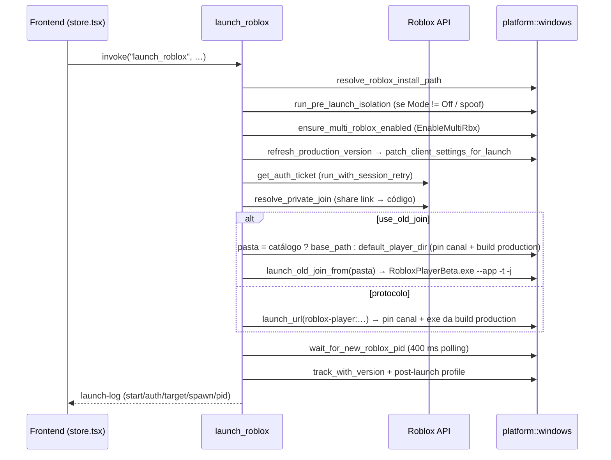

# Launch de conta única

## Objetivo

Abrir **um** cliente Roblox (`RobloxPlayerBeta.exe`) autenticado como uma conta específica, levando-o direto a um place/servidor (público, Job ID específico, VIP/privado ou "seguir usuário"), registrar o PID no tracker de processos e aplicar os pós-ajustes (posição de janela, minimizar, políticas de processo).

## Onde fica o código

| Arquivo | Papel |
|---|---|
| [launch.rs](../../src-tauri/src/commands/launch.rs) | Comando Tauri `launch_roblox` (Windows e macOS), `cancel_launch`, `cmd_kill_roblox`, `cmd_kill_all_roblox`, `cmd_enable_multi_roblox`, etc. |
| [launch_shared.rs](../../src-tauri/src/commands/launch_shared.rs) | Helpers compartilhados: `emit_launch_log`, detecção de conta moderada, `patch_client_settings_for_launch`, `get_or_create_browser_tracker_id`, `wait_for_new_roblox_pid`, `ensure_multi_roblox_enabled`, `resolve_launch_job`, `resolve_private_join`, `pick_shuffled_public_job` |
| [platform_info.rs](../../src-tauri/src/commands/platform_info.rs) | `get_platform_capabilities`: o que este SO suporta (o frontend usa para bloquear multi launch/botting fora do Windows) |
| [platform/windows/launch.rs](../../src-tauri/src/platform/windows/launch.rs) | `build_launch_url`, `launch_url` (fix de canal), `default_player_dir`, `refresh_production_version`, `cached_production_player_dir`, `launch_old_join` / `launch_old_join_from` |
| [platform/windows/core.rs](../../src-tauri/src/platform/windows/core.rs) | Mutex `ROBLOX_singletonMutex` (Multi Roblox, thread dedicada `multi-roblox-mutex`), lock do `RobloxCookies.dat` (fix 773), `generate_browser_tracker_id`, `get_roblox_path` (prefere a build production em cache) |
| [platform/windows/tracker.rs](../../src-tauri/src/platform/windows/tracker.rs) | `ProcessTracker`: PID por conta, launches pendentes, flag de cancelamento, `kill_for_user` / `kill_for_user_graceful` (só matam se o PID ainda for Roblox) |
| [platform/windows/versions.rs](../../src-tauri/src/platform/windows/versions.rs) | `resolve_roblox_install_path` (qual pasta de versão usar) |
| [account_api.rs](../../src-tauri/src/commands/account_api.rs) | `run_with_session_retry` (renova cookie e repete a chamada em erro de sessão) |
| [store.tsx](../../src/store.tsx) | `joinServer` → `invoke("launch_roblox")`; listener do evento `launch-log` |

## Fluxo

1. Frontend chama `launch_roblox(userId, placeId, jobId, launchData, followUser, joinVip, linkCode, shuffleJob)`. `shuffleJob` é opcional no backend (`Option<bool>`, ausente = `false`).
1.1. Reserva a sequência de launch (`launch_queue_start`): com outro launch em andamento — inclusive uma fila de várias contas — o comando devolve `launch-already-active` e nada é lançado (ver [multi-launch.md](multi-launch.md#uma-sequência-de-launch-por-vez)).
2. Emite `launch-log` `start` ("Iniciando launch — place …").
3. Lê settings (`IsTeleport`, `UseOldJoin`, `AutoCloseLastProcess`, `AutoCloseRobloxForMultiRbx`, `StartRobloxMinimized`).
4. Resolve a instalação: `resolve_roblox_install_path(account.fields["RobloxVersion"], …)` → `(base_path, version_id)` (ver [roblox-versions.md](roblox-versions.md)).
5. Decide `use_old_join` (ver regras abaixo).
6. Roda o isolamento pré-launch (`run_pre_launch_isolation`, ver [isolation.md](isolation.md)); se aplicou, emite `isolation-report` e, se ficaram fast flags pendentes, agenda `apply_pending_fast_flags_when_ready` (240 s).
7. Guarda de versão: `tracker.cleanup_dead_processes()`; se algum cliente rodando (ou launch pendente) tem `version_id` diferente → erro "A Roblox client is already running on a different version…".
8. Multi Roblox: se `EnableMultiRbx`, `ensure_multi_roblox_enabled`; senão `disable_multi_roblox`.
9. `refresh_production_version().await` (resolve/atualiza o cache da build production) e em seguida `patch_client_settings_for_launch(Normal)` (FPS, volume, gráficos, tamanho de janela, fast flags da allowlist ou arquivo custom). Como `get_roblox_path()` prefere a build production em cache, o `ClientAppSettings.json` é gravado na mesma pasta que será lançada.
10. Se `AutoCloseLastProcess` e a conta já tem PID → fecha (timeout 4500 ms); se não fechar, aborta.
11. `resolve_launch_job` (prefixo `vip:`, link de share, `linkCode`); com `followUser` o VIP é descartado.
12. `shuffleJob` (sem job e sem follow, ver `should_shuffle_server`): `pick_shuffled_public_job` busca servidores públicos e escolhe um índice baseado no relógio (`shuffle_server_index`, nanos % n). Falha ou lista vazia → segue com o Job ID vazio.
13. `browserTrackerId`: reutiliza o da conta ou gera e persiste um novo.
14. Auth ticket via `run_with_session_retry` (`launch-log` `auth`). Erro com "moderated"/"is banned"/"account has been" → conta movida para o grupo `moderadas` + evento `account-moderated`.
15. `resolve_private_join` → `place_id` final, `access_code` ou `link_code`, `use_private_join`.
16. Snapshot de PIDs (`get_roblox_pids`), registra launch pendente (`add_pending_launch`, timeout = espera + 30 s).
17. Spawn: `launch_old_join_from(pasta, …)` **ou** `build_launch_url(…)` + `launch_url(url).await`. No old join, `pasta` = `base_path` se a versão é do catálogo (`version_id = Some`); sem versão do catálogo (`version_id = None`) usa `default_player_dir(base_path).await` (fixa o canal e devolve a pasta da build production).
18. `wait_for_new_roblox_pid` (polling a cada 400 ms; 12 s, ou 180 s se o isolamento Full vai forçar reinstalação).
19. PID encontrado → `track_with_version`, `versions.touch_launched`, `apply_windows_post_launch_profile`, restaura posição/tamanho de janela salva (até 45 tentativas de 1 s) e, se `StartRobloxMinimized`, minimiza janelas novas por 14 s.



### Os dois modos de spawn

**Protocolo (`build_launch_url` + `launch_url`)** — monta
`roblox-player:1+launchmode:play+gameinfo:<ticket>+launchtime:<ms>+placelauncherurl:<url-encoded>+browsertrackerid:<id>+robloxLocale:en_us+gameLocale:en_us+channel:+LaunchExp:InApp`.
O `placelauncherurl` aponta para `https://assetgame.roblox.com/game/PlaceLauncher.ashx` com:
- `request=RequestPrivateGame&placeId=…&accessCode=…&linkCode=…` (VIP);
- `request=RequestFollowUser&userId=<placeId recebido>` (follow — o "place_id" carrega o userId alvo);
- `request=RequestGame` ou `RequestGameJob&gameId=<job>` + `browserTrackerId`, `isPlayTogetherGame=false`, `isTeleport=true` opcional;
- `launchData` é anexado url-encoded quando não vazio.

**Old join (`launch_old_join_from`)** — executa diretamente `<pasta>\RobloxPlayerBeta.exe --app -t <ticket> -j <PlaceLauncher URL>` (mesma URL acima, sem `browserTrackerId` no modo público). Falha se o exe não existir na pasta. A pasta é a da versão do catálogo ou, sem catálogo, `default_player_dir` (build production com canal fixado). `launch_old_join` (usado por botting e web server) é `async` e faz o mesmo: `default_player_dir(&get_roblox_path()?)`.

## Canal do Roblox e a tela de atualização (causa raiz e fix)

### Sintoma

Ao abrir uma segunda conta, aparecia a tela azul com o logo do Roblox e o botão "Cancelar" (instalador em primeiro plano) e **todas as outras contas abertas eram fechadas**.

### Causa raiz

1. O Roblox inscreve cada **conta** num canal de deploy. Observado: `ztestlinkerset` → build `version-68d22e1888b04c2f`; `zswocc-500-c`/production → `version-4310300497aa4917`.
2. Depois que uma conta entra num jogo, o cliente dela dispara em segundo plano um `RobloxPlayerInstaller -channel <canal da conta>`, que instala essa build e **reescreve** o handler do protocolo `roblox-player:` e o valor de registro `HKCU\Software\ROBLOX Corporation\Environments\RobloxPlayer\Channel` (`www.roblox.com`).
3. O próximo launch via `roblox-player:` iniciava um cliente cuja build não batia com o canal que ele lia → `updateRequired TRUE` → instalador em primeiro plano (a tela azul com "Cancelar").
4. Esse instalador procura e fecha **todo** `RobloxPlayerBeta.exe` em execução, matando as outras contas.

### Fix (em `launch_url` e `default_player_dir`, ambos `async`) — [platform/windows/launch.rs](../../src-tauri/src/platform/windows/launch.rs)

1. **A build tem que casar com o canal que o cliente vai consultar** — e quem decide isso é o campo `channel:` de dentro da URL de launch, **não** o registro. Provado nos logs (24/09/2026): registro em `ztestlinkerset` + URL com `channel:` vazio → o cliente consultou o endpoint de produção (`channel: ""`) e deu `updateRequired TRUE`; a mesma URL com a build de produção deu `FALSE`.
   - **Protocolo** (`launch_url`, caminho normal): `build_launch_url` sempre emite `channel:` vazio (= produção, igual ao site) → abre a build de **produção**. O registro não é lido nem escrito aqui.
   - **Old join** (`default_player_dir`, sem URL): o cliente cai no canal do **registro** → build daquele canal. A única escrita no registro é o reparo (`set_player_channel`) quando o endpoint do canal não responde mais.
2. `current_build_version()`: consulta o endpoint do canal — `.../v2/client-version/WindowsPlayer` para production, `.../WindowsPlayer/channel/<canal>` para os demais (o literal `production` responde 401 no formato `/channel/`, por isso a separação). Lê `clientVersionUpload` (precisa começar com `version-`). Cache em memória por canal, **60 s** (`PRODUCTION_VERSION_CACHE_TTL`); se a rede falhar, usa o cache vencido (stale). Se o canal do registro não responder mais, cai para production **e** corrige o registro, para o cliente não divergir.
3. `current_player_exe()`: se existir `%LOCALAPPDATA%\Roblox\Versions\<build>\RobloxPlayerBeta.exe`, executa `RobloxPlayerBeta.exe <url roblox-player:…>` diretamente (`CREATE_NO_WINDOW`) — o mesmo que o instalador oficial faz.
4. `ensure_current_player_exe()`: se a build do canal **não** estiver instalada (o Roblox publicou uma versão nova, ou trocou o canal da conta), o app **baixa e instala essa build ele mesmo** em `%LOCALAPPDATA%\Roblox\Versions\<build>`, reusando `install_build_to_dir` — o mesmo motor da tela de Versões ([platform/windows/versions.rs](../../src-tauri/src/platform/windows/versions.rs)). Isso evita acionar o instalador do Roblox, que roda em primeiro plano e fecha todos os clientes abertos. Um `tokio::sync::Mutex` serializa o download (um launch múltiplo baixa uma vez só) e o progresso vai para a UI pelo evento `roblox-build-install` (barra de status: "Baixando a nova versão do Roblox..."). Builds de canais de teste vêm de `/channel/common/` no CDN (fallback que `install_build_to_dir` já tinha). Cada build é baixada **uma vez** e fica em disco; jogar pelo site depois não força download nenhum, porque app e site passam a concordar sobre qual build usar.
5. Só se esse download falhar cai no último recurso `cmd /C start "" <url>` (handler do protocolo) — aí sim a tela do instalador do Roblox pode aparecer.
6. **Old join sem versão do catálogo** também é coberto: `default_player_dir(fallback)` fixa o canal e devolve a pasta da build production (ou `fallback`, a pasta resolvida pelo registro, se ela não estiver instalada). Usado em `launch_roblox`/`launch_multiple` quando `version_id = None` e dentro de `launch_old_join` (botting e web server).
7. **ClientSettings na pasta certa:** `refresh_production_version()` é aguardado antes de `patch_client_settings_for_launch` em `launch_roblox`, `launch_multiple` e no botting; `get_roblox_path()` passa a preferir `cached_production_player_dir()` (pasta da build production em cache, se tiver `RobloxPlayerBeta.exe`) antes de `HKCR\roblox\DefaultIcon`. Assim FPS/fast flags vão para a pasta que realmente é lançada, e não para a build do canal de teste da conta.

> **Regra: NUNCA lançar via handler do protocolo `roblox-player:`, e NUNCA sobrescrever o canal do registro** (exceto o reparo de canal morto em `set_player_channel`).** Qualquer novo caminho de launch por URL deve passar por `windows::launch_url`; qualquer novo old join sem versão do catálogo deve obter a pasta por `windows::default_player_dir` (nunca direto de `get_roblox_path`/`HKCR\roblox`).

Evidências ficavam em `%LOCALAPPDATA%\Roblox\logs`: `RobloxPlayerInstaller_*.log` com "Found N processes matching RobloxPlayerBeta.exe" e logs do cliente com "RobloxChannel has been set to …" seguidos de "updateRequired TRUE".

### Como diagnosticar se voltar a acontecer

```powershell
$logs = "$env:LOCALAPPDATA\Roblox\logs"

# 1. O instalador fechou clientes?
Select-String -Path "$logs\RobloxPlayerInstaller_*.log" -Pattern "Found \d+ processes matching RobloxPlayerBeta.exe" |
  Select-Object -Last 10

# 2. Qual canal cada cliente leu?
Select-String -Path "$logs\*.log" -Pattern "RobloxChannel has been set to" | Select-Object -Last 20

# 3. Algum cliente pediu atualização?
Select-String -Path "$logs\*.log" -Pattern "updateRequired TRUE" | Select-Object -Last 20

# 4. Instalador disparado com canal de conta (-channel)?
Select-String -Path "$logs\RobloxPlayerInstaller_*.log" -Pattern "-channel" | Select-Object -Last 10

# 5. Canal atual no registro (deve ser 'production' logo após um launch)
Get-ItemProperty "HKCU:\Software\ROBLOX Corporation\Environments\RobloxPlayer\Channel" -Name "www.roblox.com"

# 6. Build production atual x builds instaladas
(Invoke-RestMethod https://clientsettingscdn.roblox.com/v2/client-version/WindowsPlayer).clientVersionUpload
Get-ChildItem "$env:LOCALAPPDATA\Roblox\Versions" -Directory | Select-Object Name, LastWriteTime
```

Checklist:
- [ ] O launch passou por `windows::launch_url` (protocolo) ou por `default_player_dir` (old join sem catálogo), e não por `cmd start`/pasta do registro direto em outro lugar?
- [ ] A build lançada corresponde ao canal que está no registro? (`current_player_channel` × endpoint do canal — se divergirem, o cliente pede update.)
- [ ] A build retornada pelo `clientsettingscdn` existe em `%LOCALAPPDATA%\Roblox\Versions`? Se não, o app deveria ter baixado ela (evento `roblox-build-install`); se apareceu a tela do instalador do Roblox, esse download falhou — procure "Could not install Roblox production build" no stderr do app.
- [ ] O isolamento está em Medium/Full? Eles apagam `HKCU\Software\ROBLOX Corporation` (e Full apaga `Versions`), o que força reinstalação.
- [ ] A conta usa `RobloxVersion`/`DefaultVersion` do catálogo? Então é old join com o exe da pasta RAM: o canal **não** é fixado e a build é a do catálogo (se estiver velha, o próprio cliente pode pedir update).
- [ ] O `ClientAppSettings.json` com os flags está na pasta da build production (`cmd_get_roblox_path`)? Se não, o cache de versão pode não ter sido preenchido (falha de rede no primeiro launch).

## Regras de negócio

- **Escolha de `use_old_join`:** `false` se `Isolation.Mode = Full` **e** a versão resolvida não é do catálogo (o Full vai apagar a instalação do sistema); caso contrário `Developer.UseOldJoin || version_id.is_some()`. Ou seja: qualquer versão gerenciada pelo catálogo (override da conta, `DefaultVersion` ou a mais recente do catálogo) sempre usa old join.
- **Um launch por vez:** o launch de uma conta e a fila de várias contas compartilham a mesma reserva; disparar o segundo enquanto o primeiro anda é recusado com `launch-already-active` ("Já existe um launch em andamento"), não enfileirado. Detalhes e caminhos de liberação em [multi-launch.md](multi-launch.md#uma-sequência-de-launch-por-vez).
- **Clientes simultâneos devem estar na mesma versão:** se o tracker tiver qualquer processo/launch pendente com `version_id` diferente, o launch é recusado.
- **Multi Roblox (`EnableMultiRbx`) — são duas travas diferentes, e o app trata as duas** ([core.rs](../../src-tauri/src/platform/windows/core.rs), [singleton.rs](../../src-tauri/src/platform/windows/singleton.rs)):
  1. **`ROBLOX_singletonMutex` (preventivo).** O app cria (com `bInitialOwner = 0`) e adquire o mutex numa **thread dedicada de longa duração** (`multi-roblox-mutex`), que o segura até receber o sinal de liberação por um canal `mpsc` (`release_multi_roblox_mutex`, usado por `disable_multi_roblox` e `release_multi_roblox_handle`); só então faz `ReleaseMutex` + `CloseHandle` nessa mesma thread. Motivo: posse de mutex Win32 é por thread — `ReleaseMutex` só funciona na thread que adquiriu e, se ela terminar, o mutex fica abandonado e um cliente Roblox pode pegá-lo (voltando ao modo instância única); threads do tokio não garantem nenhuma das duas coisas. **Só resolve se o app pegar o mutex antes de qualquer cliente subir**: com um jogo já aberto (usuário entrou pelo site), o mutex é do cliente e não há como tomá-lo sem matar o processo.
  2. **`ROBLOX_singletonEvent` (o que o cliente moderno consulta).** Ao subir, o cliente checa esse nome; se existe, avisa a instância antiga e sai. `close_roblox_singleton_handles()` fecha esse handle **de fora**: enumera a tabela de handles do sistema (`NtQuerySystemInformation`), filtra só objetos do tipo Event **dos processos do Roblox**, casa o nome exato (`\...\ROBLOX_singletonEvent`, com fronteira de namespace) e fecha com `DuplicateHandle(DUPLICATE_CLOSE_SOURCE)`. O nome some, **o cliente aberto continua jogando** e o próximo sobe normal. Validado na máquina do usuário **sem elevação**.
  - **Ordem:** tenta o mutex → fecha os Events (inclusive quando o mutex foi obtido, para cobrir "app abriu primeiro, jogo pelo site depois") → segue o launch. Se nada disso resolver (quem segura o mutex não é Roblox, ex.: RAM legado) → erro específico, ou o último recurso antigo `AutoCloseRobloxForMultiRbx` matando clientes.
  - Falha de API (anti-cheat bloqueando `OpenProcess`, por exemplo) devolve 0 e cai no caminho antigo, sem quebrar o launch.
- **Fix 773:** ao habilitar/desabilitar Multi Roblox, o app abre `%LOCALAPPDATA%\Roblox\LocalStorage\RobloxCookies.dat` com compartilhamento 0 (lock exclusivo) e mantém o handle. Desativável criando `no773fix.txt` ao lado do executável.
- **Browser tracker id:** um por conta, persistido em `account.browser_tracker_id`; gerado a partir do relógio (`generate_browser_tracker_id`).
- **Sessão expirada:** `run_with_session_retry` tenta `log_out_other_sessions` para obter novo cookie, persiste e repete a operação uma vez.
- **Conta moderada:** erro de auth ticket contendo `moderated` / `is banned` / `account has been` move a conta para o grupo `moderadas` (não duplica se já estiver).
- **VIP/privado:** `vip:<código>` no Job ID força VIP; links com `privateServerLinkCode`, `linkCode` ou `code` (share links) são extraídos; códigos de share (32 hex) são resolvidos via API; código no formato de 5 partes separadas por `-` é tratado como `accessCode`, o resto como `linkCode`. Se o link tiver `/games/<id>`, o place do link prevalece.
- **Follow user:** desliga VIP e link code; o parâmetro `placeId` é usado como `userId` no `RequestFollowUser`. Follow e shuffle nunca coexistem (`should_shuffle_server` devolve `false` com `followUser`).
- **PID:** detectado como "primeiro `RobloxPlayerBeta.exe` que não estava no snapshot anterior". Se não aparecer no tempo, emite `warn` `pid` e a conta não é rastreada (sem posição de janela, sem minimizar).
- **Posição de janela:** só restaurada se a conta tiver os 4 campos `Window_Position_X/Y`, `Window_Width`, `Window_Height` (gravados pelo Watcher com `SaveWindowPositions`).
- **Eventos `launch-log`:** payload `{userId, level: info|success|warn|error, step, message}`; steps usados: `start`, `isolation`, `auth`, `moderated`, `target`, `spawn`, `pid`, `wait`. O frontend guarda no máximo 500 entradas.
- **Close All Roblox** (`cmd_kill_all_roblox`) mata todos os `RobloxPlayerBeta.exe`, chama `cancel_launch()` e remove tudo do tracker.
- **Fechar o cliente de uma conta** (`kill_for_user` / `kill_for_user_graceful`, usados por `AutoCloseLastProcess`, `cmd_kill_roblox` e botting): só mata se o PID rastreado ainda for um processo Roblox (`is_roblox_pid_alive`); caso contrário apenas remove do tracker e retorna sucesso (proteção contra reuso de PID pelo Windows).
- **Ao sair do app** com `EnableMultiRbx`: se houver mais de 1 cliente, mata todos; limpa o tracker e libera o mutex.

## Configurações relacionadas

Arquivo `RAMSettings.ini`.

| Seção | Chave | Default | Efeito |
|---|---|---|---|
| General | `EnableMultiRbx` | — | Segura `ROBLOX_singletonMutex` para permitir vários clientes |
| General | `AutoCloseRobloxForMultiRbx` | `false` | Mata clientes abertos se o mutex não puder ser adquirido |
| General | `AutoCloseLastProcess` | `false` | Fecha o cliente anterior da mesma conta antes de relançar |
| General | `StartRobloxMinimized` | `false` | Minimiza janelas novas por até 14 s após o launch |
| General | `UnlockFPS`/`MaxFPSValue`, `OverrideClientVolume`/`ClientVolume`, `OverrideClientGraphics`/`ClientGraphicsLevel`, `OverrideClientWindowSize`/`ClientWindowWidth`/`ClientWindowHeight`, `CustomClientSettings` | ver store | Aplicados em `ClientAppSettings.json` antes do launch (arquivo custom tem precedência e desativa o FPS/fast flags) |
| Developer | `UseOldJoin` | `false` | Força `RobloxPlayerBeta.exe --app -t -j` |
| Developer | `IsTeleport` | `false` | Adiciona `isTeleport=true` na URL do PlaceLauncher |
| Isolation | `Mode` | `Off` | Ver [isolation.md](isolation.md); `Full` altera a escolha de old join e a espera do PID |
| Versions | `DefaultVersion` | vazio | Ver [roblox-versions.md](roblox-versions.md) |

Campos por conta (`account.fields`): `RobloxVersion`, `Window_Position_X`, `Window_Position_Y`, `Window_Width`, `Window_Height`, e as exceções de launch abaixo.

## Exceções de launch por conta

Uma conta pode abrir com FPS, volume, qualidade, modo de tela e "minimizar ao abrir" próprios, por cima do perfil global. Serve para o caso "a conta principal abre em tela cheia a 240 fps e as outras abrem no jeito limitado".

Onde fica: `Account.fields` (`AccountData.json`), lido por `account_client_overrides` em [launch_shared.rs](../../src-tauri/src/commands/launch_shared.rs). Tela: seção **Launch Exceptions** na sidebar da conta ([AccountLaunchOverrides.tsx](../../src/components/accounts/AccountLaunchOverrides.tsx)).

| Campo | Valores | Efeito |
|---|---|---|
| `ClientOverridesEnabled` | `true` | Interruptor. Sem ele em `true`, os outros campos são ignorados (dá para guardar uma configuração desligada). |
| `ClientOverrideMaxFPS` | inteiro > 0 | `FramerateCap` + `DFIntTaskSchedulerTargetFps`. Ignorado quando há `CustomClientSettings` válido, igual ao global. |
| `ClientOverrideVolume` | fração `0.0`–`1.0` | `MasterVolume`. A tela mostra a escala de 0 a 10 do jogo e grava a fração. |
| `ClientOverrideGraphics` | `auto` ou `1`–`10` | `auto` grava `SavedQualityLevel=0` (qualidade automática) e **não** mexe no `GraphicsQualityLevel`; um número grava o nível fixo. |
| `ClientOverrideFullscreen` | `true` / `false` | `Fullscreen`. `true` também descarta o tamanho de janela global (senão o XML gravaria `Fullscreen=false` ao lado). |
| `ClientOverrideStartMinimized` | `true` / `false` | Substitui `StartRobloxMinimized` para esta conta (vale no launch e no Botting). |
| `ClientOverrideWindowWidth` / `ClientOverrideWindowHeight` | inteiros > 0 | `StartScreenSize`. Só valem **em par** — largura sem altura é ignorada. |

Campo vazio quer dizer "herda o global", não "zero": um FPS apagado não é FPS 0.

Aplicado em: launch de uma conta, fila de várias contas (dentro do laço, por conta) e Botting. O servidor HTTP local não tem contexto de conta nesse ponto e usa só o perfil global.

**Ressalva importante.** `ClientAppSettings.json` é por pasta de versão do Roblox e `GlobalBasicSettings_13.xml` é por usuário do Windows — os dois são **globais**. "Por conta" funciona porque a fila é sequencial e o patch roda imediatamente antes de cada spawn; não é isolamento de verdade. Se o jogador mudar as configurações dentro do jogo, o Roblox reescreve o XML e o valor pode vazar para a próxima conta que abrir sem exceção própria.

## Armadilhas / cuidados

- O fix de canal vale para o protocolo e para o old join **sem** versão do catálogo. Old join **com** versão do catálogo usa a pasta da versão instalada pelo app e não fixa o canal — se essa build estiver desatualizada, o próprio cliente pode pedir update.
- `launch_url`, `default_player_dir`, `launch_old_join` e `refresh_production_version` são `async` (fazem HTTP). Não chame a partir de contexto síncrono; todos os call sites atuais (`launch_roblox`, `launch_multiple`, botting, web server) já usam `.await`.
- `get_roblox_path()` é síncrono e só usa a build production se o cache já tiver sido preenchido (por `refresh_production_version`, `launch_url` ou `default_player_dir`). Por isso todos os caminhos de launch (incluindo o web server) chamam `refresh_production_version().await` antes de `patch_client_settings_for_launch`.
- O web server (`/LaunchAccount`, `/FollowUser`) e o botting **não** passam por `resolve_roblox_install_path`, isolamento nem pela guarda de versão; quando `UseOldJoin` usam `launch_old_join` (build production via `default_player_dir`, fallback para a pasta do registro).
- Com isolamento ativo e algum processo Roblox já aberto, `apply_pre_launch` **não fecha** os clientes: o isolamento é pulado (`skipped`) e o launch segue normalmente. Ou seja, o isolamento só é efetivo quando nenhum Roblox está rodando (ver [isolation.md](isolation.md)).
- Shuffle usa `SystemTime` como "aleatório"; não é uniforme de verdade. `pick_shuffled_public_job` é o mesmo helper do [launch múltiplo](multi-launch.md), onde ele roda **uma vez por conta**.
- A detecção de PID por diff de snapshot pode pegar o PID errado se outro cliente abrir ao mesmo tempo (ex.: launches concorrentes fora do fluxo sequencial).
- macOS: caminho simplificado (sem isolamento, sem versões, sem logs de launch, sem posição de janela).

## Capacidades da plataforma (`get_platform_capabilities`)

O frontend (`src/store.tsx`) chama `get_platform_capabilities` no boot e de novo
quando uma chave de `[Linux]` muda; `src/utils/platform.ts` usa o campo `os` em
`isWindowsPlatform` (sem ele, sobrava o palpite pelo user agent).

Implementado em [platform_info.rs](../../src-tauri/src/commands/platform_info.rs);
o formato é o tipo `PlatformCapabilities` de `src/types.ts` (camelCase, todos os
campos obrigatórios). A função pura `build_platform_capabilities(os,
session_type, preferred_runner)` é quem decide:

| Campo | `windows` | `macos` | `linux` / outros |
|---|---|---|---|
| `supportsSingleLaunch` / `supportsMultiLaunch` | sim | sim | não |
| `supportsWatcher` | sim | sim | não |
| `supportsWatcherMemory` | sim | não | não |
| `supportsWindowControls` | sim | não (sem grid) | não |
| `supportsBotting` | sim | não | não |
| `supportsUpdater` | sim | sim | sim |
| `supportsClientSettings` | sim | sim | não |
| `preferredRunner` / `detectedRunner` | `native` | `native` | `[Linux] PreferredRunner` / `none` |
| `reasons` / `warnings` | vazios | 1 + 1 | 1 + 1 |

`reasons[0]` é o texto que o frontend mostra ao bloquear multi launch ou
botting, então a lista nunca fica vazia quando algo está desligado.
`sessionType` é `desktop` no Windows/macOS e `$XDG_SESSION_TYPE` (ou `unknown`)
no resto. `runnerPath` é sempre `null` hoje — não há backend de launch em Linux.
