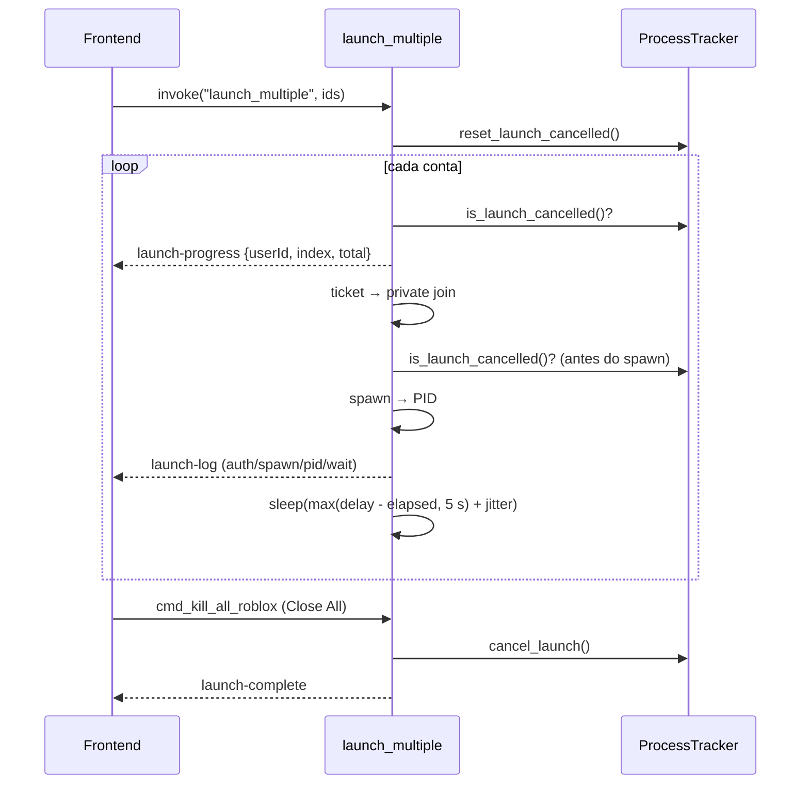

# Launch múltiplo

## Objetivo

Lançar várias contas, **uma por vez e em sequência**, no mesmo place/Job ID, espaçando os launches para não disparar o captcha do Roblox, respeitando a versão de cada conta e permitindo cancelar a fila no meio.

## Onde fica o código

| Arquivo | Papel |
|---|---|
| [launch.rs](../../src-tauri/src/commands/launch.rs) | `launch_multiple` (Windows e macOS), `cancel_launch`, `next_account`, `cmd_kill_all_roblox` |
| [launch_shared.rs](../../src-tauri/src/commands/launch_shared.rs) | Helpers reutilizados do launch único (moderação, ticket, private join, PID, logs) |
| [platform/windows/tracker.rs](../../src-tauri/src/platform/windows/tracker.rs) | Flags `launcher_cancelled` e `next_account` |
| [platform/windows/launch.rs](../../src-tauri/src/platform/windows/launch.rs) | Spawn (protocolo com canal fixado ou old join) |
| [store.tsx](../../src/store.tsx) | `launchMultiple`, `killAllRobloxProcesses`, listeners `launch-progress` / `launch-complete` / `launch-log` |
| [ChooseGameScreen.tsx](../../src/components/ChooseGameScreen.tsx), [MultiSelectSidebar.tsx](../../src/components/accounts/MultiSelectSidebar.tsx) | Chamadores (1 conta → `joinServer`; várias → `launchMultiple`) |

## Fluxo

1. Frontend: `launchMultiple(userIds, target?)` → `invoke("launch_multiple", {userIds, placeId, jobId, launchData, shuffleJob})`. Se `placeId` não for número, usa `5315046213`. O alvo é passado explicitamente para evitar ler o place/job anterior do estado React. `shuffleJob` é **opcional** no backend (`Option<bool>`): quem não mandar o campo cai em `false`.
2. Backend lê `AccountJoinDelay` (default 8) e aplica o piso `MIN_JOIN_GAP_SECS = 8`. Valor negativo (INI editado à mão) é tratado como ausente — antes o cast `i64 -> u64` virava `u64::MAX` e a fila travava entre duas contas.
3. `tracker.reset_launch_cancelled()`.
4. Isolamento pré-launch roda **uma vez**, antes do loop.
5. Para cada `uid` na ordem recebida:
   1. Se `is_launch_cancelled()` → sai do loop.
   2. `launch-log` `start` ("Conta i/N — place …").
   3. Resolve versão da conta (`RobloxVersion` → `DefaultVersion` → catálogo → sistema). Falha → `launch-progress` com `error: "version-resolve-failed"`, espera 2 s, próxima conta.
   4. Guarda de versão: se houver cliente/pendente em outra versão → `launch-progress` com `error: "version-conflict"`, próxima conta (sem espera).
   5. Emite `launch-progress {userId, index, total}`.
   5.1. `shuffleJob` ligado e Job ID vazio: **esta conta** busca a lista de servidores públicos do place e sorteia o seu (`pick_shuffled_public_job`), logando `launch-log` `target` com o Job ID escolhido. Cada conta sorteia o seu — o lote se espalha em vez de entrar todo no mesmo servidor.
   6. Multi Roblox + `refresh_production_version().await` + patch do `ClientAppSettings.json` (na pasta da build production, ver [launch.md](launch.md#canal-do-roblox-e-a-tela-de-atualização-causa-raiz-e-fix)).
   7. `AutoCloseLastProcess`: se não conseguir fechar o cliente anterior, espera 2 s e pula.
   8. Auth ticket; erro → loga, marca moderada se for o caso, espera 2 s, pula.
   9. `resolve_private_join`; erro → espera 2 s, pula.
   10. Se `is_launch_cancelled()` → sai do loop (checagem logo antes do spawn: "Close All Roblox" clicado durante o auth/resolução não abre mais um cliente).
   11. Spawn (old join — pasta do catálogo ou `default_player_dir` quando sem versão do catálogo — ou protocolo), espera PID (12 s ou 180 s), rastreia, aplica perfil pós-launch e minimização.
   12. Se não é a última conta: espera (ver regras de espaçamento).
6. Ao fim (ou cancelamento) emite `launch-complete`.

## Regras de negócio

- **Ordem:** exatamente a ordem do array `userIds` enviado pelo frontend (ordem de seleção/lista). O backend não reordena.
- **Mesmo destino para todos:** place e job são os escolhidos na UI; overrides por conta de "jogo salvo" (`SavedPlaceId`/`SavedJobId`) foram removidos de propósito.
- **VIP:** `launch_multiple` não recebe `joinVip`/`linkCode`; chama `resolve_launch_job(job, false, "")`. VIP só funciona se o Job ID vier como `vip:<código>` ou como link de servidor privado/share.
- **Follow user:** não suportado no multi (sempre `false`).
- **Shuffle (`shuffleJob`):** o sorteio é **por conta**, não por lote. Cada iteração chama `pick_shuffled_public_job(accounts, uid, placeId)`, que busca `/games/<place>/servers/Public` com o cookie daquela conta e escolhe o índice por relógio (`shuffle_server_index(nanos, n)`); duas contas quase sempre caem em servidores diferentes, e nada garante que fiquem juntas. Só vale quando o Job ID está **vazio** (`should_shuffle_server`): um Job ID explícito — inclusive `vip:<código>` — manda. Se a listagem falhar ou vier vazia, a conta segue com o Job ID vazio (servidor público qualquer), sem erro. O argumento é opcional (`Option<bool>`), então `invoke` sem o campo continua funcionando; `None` = não sortear.
- **Espaçamento síncrono (`AsyncJoin = false`):**
  - `delay = max(AccountJoinDelay, 8)` segundos, medido a partir do **início** da iteração da conta (desconta auth + espera de PID);
  - `wait = max(delay - elapsed, 5 s) + jitter`, com `jitter = 300 + (subsec_millis % 1200)` ms (300–1499 ms);
  - loga `launch-log` `wait` ("Aguardando Ns antes da próxima conta (anti-captcha)").
  - Motivo: o Roblox pede "verify you're not a robot" quando resgates de auth ticket do mesmo IP chegam próximos demais.
- **Modo `AsyncJoin = true`:** após cada conta, espera o sinal `next_account()` (comando Tauri) ou cancelamento, com teto de 120 s (polling de 500 ms). Sem espaçamento anti-captcha nesse modo.
- **Cancelamento:** `cmd_kill_all_roblox` (botão "Close All Roblox") e `cancel_launch` setam `launcher_cancelled`. O loop verifica no início de cada iteração, **logo antes do spawn** de cada conta e no loop de espera do AsyncJoin. `reset_launch_cancelled` só é chamado no início de um novo `launch_multiple`.
- **Versão por conta:** cada conta resolve sua própria versão; mas uma conta cuja versão diverge dos clientes já abertos é pulada (`version-conflict`). Na prática todas as contas de um lote devem estar na mesma versão.
- **Contas moderadas:** não são filtradas antes; a falha no auth ticket as move para o grupo `moderadas`, emite `account-moderated` (o frontend recarrega a lista e mostra toast) e a fila segue.
- **Erro de Multi Roblox** (`ensure_multi_roblox_enabled`) **aborta a fila inteira** (retorna `Err`), diferente dos demais erros por conta.
- **Eventos:** `launch-progress {userId, index, total[, error, message]}` (UI mostra "Launching account i/N"), `launch-log`, `launch-complete` (UI limpa estado após 1,5 s).
- **Restart de clientes** (`restartRobloxClients` no store): fecha cada cliente lançado pelo app com `cmd_kill_roblox`, espera 250 ms e relança via `launchMultiple` (ou `joinServer` se for 1).

## Fila observável e cancelamento

O lote deixou de ser uma caixa-preta: o backend mantém a fila como estado e emite o evento `launch-queue` a cada transição, com uma entrada por conta.

| Estado | Quando |
|---|---|
| `queued` | ainda não chegou a vez |
| `launching` | entre o início do trabalho da conta e o spawn |
| `done` | PID do cliente confirmado |
| `failed` | erro (mensagem em `error`), inclusive "PID não detectado no tempo esperado" |
| `cancelled` | pulada por cancelamento |

Comandos: `get_launch_queue()` (snapshot para montar a UI), `cancel_account_launch(userId)` e `stop_launch_queue()`.

**Regras (decididas com o usuário):**

- **Cancelar nunca fecha cliente.** Conta já lançada (`done`) não é afetada; cancelar devolve `false`.
- `stop_launch_queue` cancela só quem está `queued`. Quem está `launching` termina — não dá para abortar no meio do auth — e quem já entrou continua jogando.
- Isso é **diferente** do "Close All Roblox" (`cancel_launch` + matar clientes). São ações distintas na UI de propósito. O `cancel_launch` também esvazia a fila na hora, para o painel não ficar mostrando contas que não vão mais entrar.
- Um lote novo substitui a fila anterior; `launch_roblox` (conta única) alimenta a mesma fila com uma entrada, para a UI ser uniforme.

A interface disso é o **Painel de Sessão** — ver [ui-layout.md](ui-layout.md#painel-de-sessão).

## Configurações relacionadas

| Seção | Chave | Default | Efeito |
|---|---|---|---|
| General | `AccountJoinDelay` | `8` | Espaçamento alvo entre contas (piso 8 s; valor negativo = default) |
| General | `AsyncJoin` | `false` | Espera sinal `next_account` em vez de tempo |
| General | `EnableMultiRbx` | — | Obrigatório para vários clientes simultâneos |
| General | `AutoCloseLastProcess` | `false` | Fecha cliente anterior da conta antes de relançar |
| General | `AutoCloseRobloxForMultiRbx` | `false` | Mata clientes se o mutex não puder ser adquirido |
| General | `StartRobloxMinimized` | `false` | Minimiza janelas novas |
| Developer | `UseOldJoin`, `IsTeleport` | `false` | Iguais ao launch único |
| Isolation | `Mode` | `Off` | Roda uma vez antes da fila |

## Armadilhas / cuidados

- O cancelamento **não interrompe** o `sleep` de espaçamento em andamento nem a espera de PID de um cliente já spawnado; mas a conta em andamento não abre cliente se o cancelamento chegar antes do spawn (checagem após auth ticket/private join).
- `launch_multiple` não restaura posição de janela salva (só o launch único faz isso).
- Diminuir o piso de 8 s / residual de 5 s volta a provocar captcha — o histórico de commits ("diminuindo delay", "ajuste de tempo no join") mostra que esse valor foi calibrado.
- Isolamento só é aplicado se nenhum Roblox estiver aberto quando a fila começa; com clientes abertos ele é pulado (`skipped`) e nada é fechado.
- No macOS o delay é `max(AccountJoinDelay, 12)` só quando `EnableMultiRbx`; não há jitter nem piso de 8 s (a sanitização de valor negativo vale nos dois, via `configured_join_delay_seconds`).
- O sorteio de servidor custa uma chamada HTTP por conta **dentro** da janela de espaçamento: ela entra no `elapsed` da iteração, então não soma tempo ao delay alvo, mas pode comer o residual e deixar o gap no piso de 5 s + jitter.
