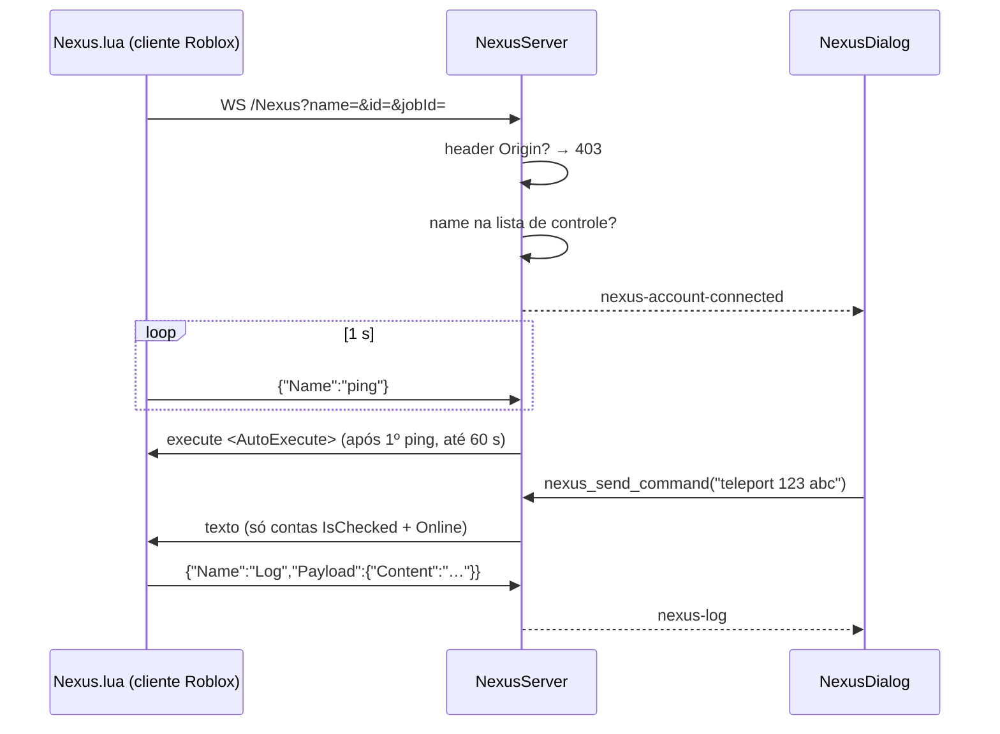

# Nexus (controle de contas via WebSocket + Nexus.lua)

## Objetivo

Servidor WebSocket local ao qual o script `Nexus.lua` (rodando dentro do cliente Roblox via executor) se conecta, permitindo ao app enviar comandos às contas em jogo (executar Lua, teleport, rejoin, mute, modo performance), receber logs e montar elementos de UI customizados (botões, caixas de texto, numéricos, labels) definidos pelo script.

## Onde fica o código

| Arquivo | Papel |
|---|---|
| [Cargo.toml](../../src-tauri/Cargo.toml) | Feature `nexus` (incluída em `default`); `mod nexus` só compila com ela ([lib.rs](../../src-tauri/src/lib.rs)) |
| [nexus/websocket.rs](../../src-tauri/src/nexus/websocket.rs) | Singleton `NEXUS` / `nexus()` |
| [nexus/websocket/core.rs](../../src-tauri/src/nexus/websocket/core.rs) | Tipos: `NexusServer`, `ControlledAccount`, `AccountStatus`, `CustomElement`, `NexusStatus`, `AccountView`, `Command` |
| [nexus/websocket/server_impl.rs](../../src-tauri/src/nexus/websocket/server_impl.rs) | `start`/`stop`, persistência `AccountControlData.json`, `send_command`, `send_to_all`, `handle_message` (protocolo cliente → app) |
| [nexus/websocket/connection.rs](../../src-tauri/src/nexus/websocket/connection.rs) | Handshake, validação de query, auto-execute, loop de leitura/escrita |
| [commands/services.rs](../../src-tauri/src/commands/services.rs) | Comandos Tauri (`start_nexus_server`, `stop_nexus_server`, `get_nexus_status`, `get_nexus_accounts`, `add_nexus_account`, `remove_nexus_accounts`, `update_nexus_account`, `nexus_send_command`, `nexus_send_to_all`, `get_nexus_log`, `clear_nexus_log`, `get_nexus_elements`, `set_nexus_element_value`, `export_nexus_lua`) |
| [assets/Nexus.lua](../../src-tauri/assets/Nexus.lua) | Script cliente, embutido no binário com `include_str!` |
| [NexusDialog.tsx](../../src/components/dialogs/NexusDialog.tsx) | UI; [featureFlags.ts](../../src/featureFlags.ts) `ENABLE_NEXUS` (env `VITE_ENABLE_NEXUS`, default `true`) |

> **Nota:** a "geração" do Nexus.lua **não** fica em `commands/generators.rs` (esse arquivo é o gerador de contas via provedor externo). `export_nexus_lua` apenas grava o conteúdo embutido de `assets/Nexus.lua` em `<diretório atual>\Nexus.lua` e retorna o caminho.

## Fluxo

1. Servidor sobe no setup do app se `AccountControl.StartOnLaunch`, ou via `start_nexus_server`. Bind em `127.0.0.1:<NexusPort>` (ou `0.0.0.0` com `AllowExternalConnections`).
2. O usuário adiciona o username da conta à lista de controle (`add_nexus_account`) — persistida em `AccountControlData.json` na pasta de dados do usuário (`get_runtime_data_dir`, ver [architecture.md](../architecture.md#arquivos-de-persistência)).
3. No jogo, `Nexus.lua` conecta em `ws://<host>/Nexus?name=<LocalPlayer.Name>&id=<UserId>&jobId=<game.JobId>` (host default `localhost:5242`; em falha tenta de novo a cada 12 s).
4. Handshake: se a requisição tiver header `Origin` (conexão vinda de página web no navegador), é recusada com **403** ("Connections from web pages are not allowed"); executores Lua não mandam `Origin`. Depois o servidor valida: `name` e `id` presentes, `id` numérico, `name` **precisa estar na lista de controle** — senão fecha sem mensagem. Marca `Online`, grava `in_game_job_id`, emite `nexus-account-connected`.
5. Cliente manda `ping` a cada 1 s; o primeiro ping seta `client_can_receive = true`. Se a conta tiver `AutoExecute`, uma task aguarda esse flag (polling 80 ms) e envia `execute <script>`; ela desiste após **60 s** ou assim que o socket fechar (`sender.is_closed()`).
6. Comandos da UI: `nexus_send_command(msg)` envia para contas **marcadas (`IsChecked`) e Online**; `nexus_send_to_all(msg)` envia para todas as conexões.
7. Desconexão/stop: só se a entrada no mapa de conexões ainda for **deste** socket (`sender.same_channel`), remove a conexão, marca `Offline` e emite `nexus-account-disconnected`. Se outra conexão com o mesmo nome já substituiu a entrada (rejoin), o socket antigo sai sem mexer em nada.

## Protocolo

### Cliente → servidor (JSON `{"Name": <cmd>, "Payload": {<string>: <string>}}`)

| `Name` | Payload | Efeito no servidor |
|---|---|---|
| `ping` | — | Atualiza `last_ping`, `client_can_receive = true` |
| `Log` | `Content` | Adiciona ao log em memória + evento `nexus-log {message}` |
| `GetText` | `Name` | Responde `ElementText:<valor>` com o valor do elemento |
| `SetRelaunch` | `Seconds` (f64) | Salva `RelaunchDelay` da conta |
| `SetAutoRelaunch` | `Content` (`true`/`false`) | Salva `AutoRelaunch` |
| `SetPlaceId` | `Content` (i64) | Salva `PlaceId` |
| `SetJobId` | `Content` | Salva `JobId` |
| `Echo` | `Content` | Reenvia `Content` para **todas** as conexões |
| `CreateButton` / `CreateTextBox` / `CreateNumeric` / `CreateLabel` | `Name`, `Content`, `Size` ("w,h"), `Margin` ("l,t,r,b"), `DecimalPlaces`, `Increment` | Cria elemento (ignora se o nome já existe) + `nexus-element-created` |
| `NewLine` | — | Quebra de linha na UI + `nexus-element-newline` |

Mensagens que não são JSON válido ou com nome desconhecido são ignoradas.

### Servidor → cliente (texto puro, `"<comando> <argumento>"`)

Interpretado por `Nexus.lua` (comando em minúsculas até o primeiro espaço):

| Mensagem | Efeito no cliente |
|---|---|
| `execute <lua>` | `loadstring` + execução; `print` redirecionado para `Log` |
| `teleport <placeId> [jobId]` | `TeleportService` para o place (ou instância) |
| `rejoin` | Teleporta para o mesmo place/job |
| `mute` / `unmute` | Zera / restaura `MasterVolume` |
| `performance [fps]` | Desliga render 3D e limita FPS (default 8) quando sem foco |
| `ButtonClicked:<nome>` | Dispara o callback registrado com `Nexus:OnButtonClick` (enviado pela UI ao clicar num botão customizado) |
| `ElementText:<valor>` | Resposta a `GetText` |

## Regras de negócio

- Só contas presentes em `AccountControlData.json` podem conectar; a chave é o **username** exato.
- Um username = uma conexão (nova conexão com o mesmo nome substitui a entrada no mapa). No rejoin a nova conexão registra antes de a antiga fechar; a limpeza da antiga compara o canal (`same_channel`) e não apaga nem marca `Offline` a nova.
- **Anti-página web:** handshake com header `Origin` → 403.
- `send_command` exige `IsChecked` **e** status `Online`.
- Elementos customizados e log ficam só em memória (perdidos ao reiniciar o app); elementos não são removidos quando o cliente desconecta.
- Campos persistidos por conta: `Username`, `AutoExecute`, `PlaceId`, `JobId`, `RelaunchDelay` (default 30), `AutoRelaunch`, `IsChecked`.
- `stop` derruba todas as conexões e marca todas as contas `Offline`.
- Sem a feature `nexus`, os comandos Tauri retornam "Nexus is disabled in this build" (ou listas vazias).

## Configurações relacionadas

Seção `[AccountControl]`:

| Chave | Default | Efeito |
|---|---|---|
| `NexusPort` | `5242` | Porta do WebSocket |
| `AllowExternalConnections` | `false` | Bind `0.0.0.0` |
| `StartOnLaunch` | `false` | Sobe o servidor junto com o app |
| `RelaunchDelay`, `LauncherDelay`, `AutoMinimizeEnabled`, `AutoMinimizeInterval`, `AutoCloseEnabled`, `AutoCloseInterval`, `AutoCloseType`, `InternetCheck`, `UsePresence`, `MaxInstances` | ver [store.rs](../../src-tauri/src/data/settings/store.rs) | Criados nos defaults; não lidos pelo backend do Nexus |

## Armadilhas / cuidados

- **Sem autenticação:** qualquer processo local (ou da rede, com `AllowExternalConnections`) que saiba um username da lista pode conectar e receber comandos/`Echo`; `execute` roda Lua arbitrário no cliente. O bloqueio de `Origin` só impede páginas web no navegador, não processos locais.
- `AutoRelaunch`/`RelaunchDelay` são apenas armazenados: não existe lógica no backend que relance contas a partir deles.
- `AccountControlData.json` fica na pasta de dados do usuário (junto dos outros arquivos do app) e entra nos backups; antes ficava ao lado do executável e sumia ao mover o `.exe`.
- `export_nexus_lua` grava no **diretório de trabalho atual** do processo, que pode não ser a pasta esperada.
- O `Nexus.lua` depende de APIs de executor (`WebSocket.connect`, `loadstring`, `getgenv`, `setfpscap`).
