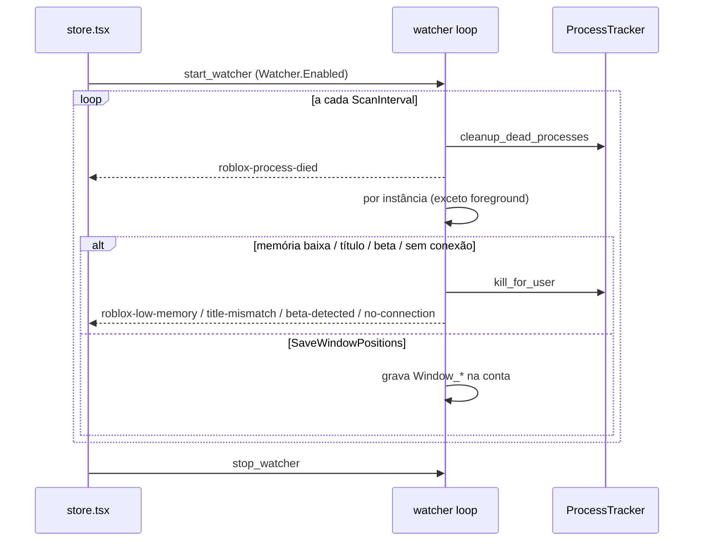

# Watcher (monitor de processos Roblox)

## Objetivo

Varredura periódica dos clientes Roblox **lançados e rastreados pelo app** para: detectar processos que morreram, fechar clientes travados/desconectados/em tela "Roblox Beta" ou com título inesperado, e salvar a posição/tamanho da janela de cada conta.

## Onde fica o código

| Arquivo | Papel |
|---|---|
| [watcher.rs](../../src-tauri/src/commands/watcher.rs) | `start_watcher` (Windows e macOS), `stop_watcher`, config `load_windows_watcher_config` |
| [platform/windows/tracker.rs](../../src-tauri/src/platform/windows/tracker.rs) | Sessão do watcher (`try_start_watcher`, `is_watcher_session_active`, `stop_watcher`), `cleanup_dead_processes`, `kill_for_user` |
| [platform/windows/windowing.rs](../../src-tauri/src/platform/windows/windowing.rs) | `find_main_window`, `get_window_title`, `get_window_position`, `get_process_memory_mb` (working set) |
| [store.tsx](../../src/store.tsx) | Liga/desliga conforme `Watcher.Enabled` e mostra toasts dos eventos |

## Fluxo

1. O frontend chama `start_watcher` quando `Watcher.Enabled = "true"` (e `stop_watcher` quando desliga ou no unmount).
2. `try_start_watcher` garante uma única sessão (retorna sem fazer nada se já ativa; cada start/stop incrementa o id de sessão).
3. Loop enquanto a sessão estiver ativa; a config é relida do INI a cada iteração. A cada `ScanInterval`:
   1. `cleanup_dead_processes()` → para cada conta cujo PID sumiu: evento `roblox-process-died {userId}`.
   2. Para cada instância rastreada com janela principal:
      - **Pula a janela em foreground** (a que o usuário está usando).
      - Registra o início (PID, instante) para a *startup grace* de 30 s.
      - **Memória** (`CloseRbxMemory`, após grace): se working set < `MemoryLowValue` MB → mata e emite `roblox-low-memory {userId, memoryMb}`.
      - **Título** (`CloseRbxWindowTitle`, após grace, título esperado não vazio): título ≠ `ExpectedWindowTitle` → mata e emite `roblox-title-mismatch {userId, title, expected}`.
      - **Beta** (`ExitOnBeta`): título contém "roblox beta" (case-insensitive) → mata e emite `roblox-beta-detected {userId, title}`.
      - **Sem conexão** (`ExitIfNoConnection`): título contém "disconnected", "connection error", "lost connection" ou "no connection" → começa a contar; se persistir ≥ `NoConnectionTimeout` s → mata e emite `roblox-no-connection {userId, title, timeout}`. Título normal zera o contador.
      - **Posição** (`SaveWindowPositions`, após grace): se (x, y, w, h) mudou desde a última gravação, salva em `Window_Position_X/Y`, `Window_Width`, `Window_Height` da conta.
4. Dorme entre 50 ms e 1 s até a próxima varredura.

## Regras de negócio

- Só age sobre processos **no tracker** (lançados pelo app com PID detectado). Clientes abertos por fora são ignorados.
- A janela em primeiro plano nunca é avaliada (nem para kill, nem para salvar posição).
- *Startup grace* fixa de 30 s por PID vale para memória, título e posição; **não** vale para beta e sem conexão.
- A regra de memória é de **memória baixa** (cliente que caiu para um working set pequeno, típico de travado/erro), não de consumo alto.
- A ordem de avaliação é memória → título → beta → sem conexão → posição; o primeiro kill bem-sucedido encerra a avaliação daquela instância.
- Toda ação é `kill_for_user` (TerminateProcess + espera até 1,2 s e remove do tracker). Se o PID rastreado não for mais um processo Roblox (cliente já fechou e o Windows reutilizou o PID), `kill_for_user` não mata nada: só remove do tracker e retorna `true` (o evento correspondente ainda é emitido). O Watcher **não relança** a conta; relançar é papel do botting ou do usuário.
- **Todo evento do Watcher também vira linha no Console** (`emit_launch_log`, `step: "watcher"`). O evento só virava toast, que some em 2,5 s: quem voltasse depois não tinha como saber por que a conta caiu. Um teste estrutural (`watcher_console_tests`) lê o próprio arquivo e exige a linha ao lado de cada `emit` — assim cobre também o ramo de macOS, que não compila no Windows.
- As posições salvas são usadas pelo [launch único](launch.md) para restaurar a janela.
- macOS: não lê títulos; lê o log do cliente a cada `ReadInterval` ms procurando linhas de desconexão ("sending disconnect with reason", "error code: 277", …), reconexão ("joining game") e retorno para a home ("returntoluaapp: … returning from game" = beta). Não tem memória, título nem posição.

## Configurações relacionadas

Seção `[Watcher]`:

| Chave | Default | Clamp | Efeito |
|---|---|---|---|
| `Enabled` | `false` | — | Frontend inicia/para o watcher |
| `ScanInterval` | `6` (s) | 1–3600 | Intervalo de varredura |
| `ReadInterval` | `250` (ms) | 50–60000 | Só macOS: leitura de logs |
| `CloseRbxMemory` | `false` | — | Liga a regra de memória baixa |
| `MemoryLowValue` | `200` (MB) | 1–16384 | Limite inferior de working set |
| `CloseRbxWindowTitle` | `false` | — | Liga a regra de título |
| `ExpectedWindowTitle` | `Roblox` | — | Título esperado exato |
| `ExitOnBeta` | `false` | — | Fecha clientes com "Roblox Beta" no título |
| `ExitIfNoConnection` | `false` | — | Fecha clientes desconectados |
| `NoConnectionTimeout` | `60` (s) | 1–3600 | Tempo desconectado antes de fechar |
| `SaveWindowPositions` | `false` | — | Persiste posição/tamanho por conta |

## Armadilhas / cuidados

- `ExpectedWindowTitle` é comparação **exata**; qualquer variação (idioma, sufixo) mata o cliente após 30 s.
- `MemoryLowValue` alto demais mata clientes saudáveis que ainda estão carregando após a grace.
- A detecção de desconexão depende do texto do título da janela, que pode mudar entre versões do Roblox.
- Salvar posição escreve no arquivo de contas (encriptado) sempre que a janela se move; com muitas contas isso gera várias gravações.
- O loop relê settings a cada iteração, então mudanças no INI valem sem reiniciar, mas `Enabled` é controlado pelo frontend.
