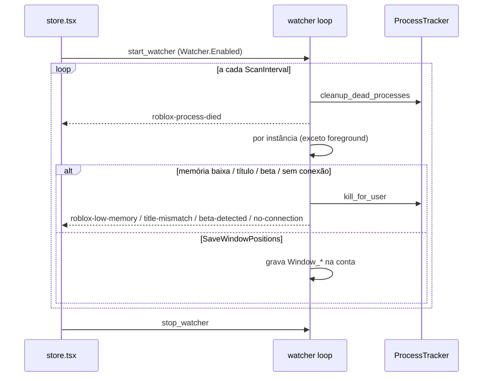

# Watcher (monitor de processos Roblox)

## Objetivo

Varredura periódica dos clientes Roblox **lançados e rastreados pelo app** para: detectar processos que morreram, fechar clientes travados/desconectados/em tela "Roblox Beta" ou com título inesperado, e salvar a posição/tamanho da janela de cada conta.

## Onde fica o código

| Arquivo | Papel |
|---|---|
| [watcher.rs](../../src-tauri/src/commands/watcher.rs) | `start_watcher` (Windows e macOS), `stop_watcher`, config `load_windows_watcher_config` |
| [client_health.rs](../../src-tauri/src/commands/client_health.rs) | Monitor de quedas: classificador do log, máquina de estados da sessão, laço de 2 s (sempre ligado no Windows) |
| [platform/windows/tracker.rs](../../src-tauri/src/platform/windows/tracker.rs) | Sessão do watcher (`try_start_watcher`, `is_watcher_session_active`, `stop_watcher`), `cleanup_dead_processes`, `kill_for_user` |
| [platform/windows/windowing.rs](../../src-tauri/src/platform/windows/windowing.rs) | `find_main_window`, `get_window_title`, `get_window_position`, `get_process_memory_mb` (working set) |
| [store.tsx](../../src/store.tsx) | Liga/desliga conforme `Watcher.Enabled` e mostra toasts dos eventos |

## Fluxo

1. O frontend chama `start_watcher` quando `Watcher.Enabled = "true"` (e `stop_watcher` quando desliga ou no unmount).
2. `try_start_watcher` garante uma única sessão (retorna sem fazer nada se já ativa; cada start/stop incrementa o id de sessão).
3. Loop enquanto a sessão estiver ativa; a config é relida do INI a cada iteração. A cada `ScanInterval`:
   1. `cleanup_dead_processes()` → para cada conta cujo PID sumiu: evento `roblox-process-died {userId}`.
   2. Para cada instância rastreada com janela principal:
      - **Pula a janela em foreground** (a que o usuário está usando).
      - Registra o início (PID, instante) para a *startup grace* de 30 s.
      - **Memória** (`CloseRbxMemory`, após grace): se working set < `MemoryLowValue` MB → mata e emite `roblox-low-memory {userId, memoryMb}`.
      - **Título** (`CloseRbxWindowTitle`, após grace, título esperado não vazio): título efetivo (sem o nome da conta que o app pôs — ver [Nome da conta na janela](#nome-da-conta-na-janela)) ≠ `ExpectedWindowTitle` → mata e emite `roblox-title-mismatch {userId, title, expected}`.
      - **Beta** (`ExitOnBeta`): título contém "roblox beta" (case-insensitive) → mata e emite `roblox-beta-detected {userId, title}`.
      - **Sem conexão** (`ExitIfNoConnection`): o log do cliente diz que caiu (ver [Quedas](#quedas-lidas-do-log-do-cliente)); sem log achado, o título contém "disconnected", "connection error", "lost connection" ou "no connection" → começa a contar; se persistir ≥ `NoConnectionTimeout` s → mata e emite `roblox-no-connection {userId, title, timeout}`. Título normal zera o contador.
      - **Posição** (`SaveWindowPositions`, após grace): se (x, y, w, h) mudou desde a última gravação, salva em `Window_Position_X/Y`, `Window_Width`, `Window_Height` da conta.
4. Dorme entre 50 ms e 1 s até a próxima varredura.

## Regras de negócio

- Só age sobre processos **no tracker** (lançados pelo app com PID detectado). Clientes abertos por fora são ignorados.
- A janela em primeiro plano nunca é avaliada (nem para kill, nem para salvar posição).
- *Startup grace* fixa de 30 s por PID vale para memória, título e posição; **não** vale para beta e sem conexão.
- A regra de memória é de **memória baixa** (cliente que caiu para um working set pequeno, típico de travado/erro), não de consumo alto.
- A ordem de avaliação é memória → título → beta → sem conexão → posição; o primeiro kill bem-sucedido encerra a avaliação daquela instância.
- Toda ação é `kill_for_user` (TerminateProcess + espera até 1,2 s e remove do tracker). Se o PID rastreado não for mais um processo Roblox (cliente já fechou e o Windows reutilizou o PID), `kill_for_user` não mata nada: só remove do tracker e retorna `true` (o evento correspondente ainda é emitido). O Watcher **não relança** a conta; relançar é papel do Auto Rejoin ou do usuário.
- **Todo evento do Watcher também vira linha no Console** (`emit_launch_log`, `step: "watcher"`). O evento só virava toast, que some em 2,5 s: quem voltasse depois não tinha como saber por que a conta caiu. Um teste estrutural (`watcher_console_tests`) lê o próprio arquivo e exige a linha ao lado de cada `emit` — assim cobre também o ramo de macOS, que não compila no Windows.
- As posições salvas são usadas pelo [launch único](launch.md) para restaurar a janela.
- macOS: não lê títulos; lê o log do cliente a cada `ReadInterval` ms com o mesmo classificador do Windows (`classify_log_line`: queda, expulsão e servidor fechado contam; o 285 de saída e de teleporte não) e procura o retorno para a home ("returntoluaapp: … returning from game" = beta). Não tem memória, título nem posição, nem o monitor de quedas da Sessão.

## Quedas lidas do log do cliente

Independente do Watcher (roda com ele desligado também), o **monitor de quedas**
([client_health.rs](../../src-tauri/src/commands/client_health.rs)) acompanha
cada cliente rastreado — lançado pelo app **ou** adotado do site — e diz **por
que** a conta caiu. Só lê: o log (aberto só para leitura) e a lista de processos.

- **Qual log é de qual cliente:** o mesmo casamento da varredura de clientes de
  fora (thread do cabeçalho → PID, ver [external-clients.md](external-clients.md)),
  agora num `LogLocator` usado pelos dois. Log não achado: tenta de novo a cada 10 s.
- **Leitura:** a cada 2 s, só os bytes novos, até o último fim de linha (até 8 MB
  por passada). Na primeira vez lê o log inteiro e fica com o estado do fim dele.
- **Classificador puro** (`classify_log_line`, testes `client_log_classifier_tests`):

| Linha (cliente de hoje) | Evento |
|---|---|
| `! Joining game '<job>' place <place> at <ip>` | entrou num jogo (limpa a queda) |
| `UgcExperienceController: doTeleport:` / `finishTeleportWithJoinScriptPayload` / `[FLog::SessionTransitionFSM] Teleported.` | teleporte |
| `[FLog::SingleSurfaceApp] leaveUGCGameInternal` / `[FLog::SessionTransitionFSM] Tearing down.` / `returnToLuaApp` | saída voluntária |
| `Disconnection Notification. Reason: N`, `Sending disconnect with reason: N` (0.740/0.741), `Disconnected from server for reason: Player: N (...)` (0.742), `Error Code: N` (256–299) | código de desconexão |

| Código | O que vira |
|---|---|
| 285 | **nada** — é a saída pedida pelo próprio cliente: aparece em toda saída e em todo teleporte (no 0.742, até depois do join do servidor novo) |
| 267 | expulso (`Kicked`), com a mensagem do jogo quando a linha `kicked from this experience: …` aparece |
| 274, 275 | o servidor fechou |
| 264, 273 (276 só pelos concorrentes) | caiu: a conta entrou em outro lugar |
| 277, 279, 266, 260–262 | caiu: perdeu a conexão |
| 278 | caiu: parada tempo demais |
| outro | caiu (com o código no tooltip) |

- **Teleporte não é queda:** uma queda perto (8 s) de uma linha de teleporte só
  vale se a conta não entrar no jogo novo em 8 s. Depois da saída voluntária,
  nada mais conta como queda.
- **Fechou sozinho:** o processo terminou dentro de um jogo, sem linha de saída,
  sem queda e **sem o app tê-lo fechado** (`kill_process` anota o PID —
  `was_terminated_by_app`). Sem log achado não chuta nada.
- **O que sai:** `health` em `get_running_instances` (Sessão e painel da conta),
  o evento `roblox-client-health` (toast) e uma linha no Console
  (`step: "client"`, ex.: "Caiu: perdeu a conexão (código 277)").
- **Exit If No Connection** passa a usar o log quando ele foi achado (queda,
  expulsão ou servidor fechado contam como sem conexão); o título da janela
  fica só de reserva para o cliente sem log (`client_connection_lost`).
- Calibrado em 09/10/2026 com os ~220 logs da máquina do dono (0.740 a 0.742):
  `client_log_real_probe` (`#[ignore]`, só leitura) não acha nenhuma queda falsa
  neles. Os logs só tinham o código 285; os outros códigos vêm do enum
  `ConnectionError` do Roblox e dos concorrentes e precisam de teste real.

## Nome da conta na janela

Também no monitor de [client_health.rs](../../src-tauri/src/commands/client_health.rs),
com o Watcher ligado ou não: cada janela de cliente rastreado (lançado pelo app
ou adotado do site — adotado quer dizer que a conta já foi identificada) ganha o
título **`Roblox — <alias ou username>`**, para saber quem é quem na barra de
tarefas. Opção `General.ShowAccountNameOnWindow` (padrão ligado, só Windows).

- **Nomes ocultos:** o nome sai mascarado exatamente como a tela do app mostra
  (`mask_account_name`, espelho de `maskAccountName`; os dois lados testam os
  mesmos casos de `src/utils/accountNameCases.json`). Nome escondido nunca vai
  para a barra de tarefas.
- **Só mexe no título normal:** se a janela está com "Roblox" (ou com o título
  que o app pôs), põe o nome; se o Roblox mostra outra coisa (erro, "Roblox
  Beta"), deixa como está. O Roblox pode voltar o título para "Roblox"
  (teleporte): a cada 2 s o monitor confere e põe de novo.
- **Desligar** devolve "Roblox" às janelas renomeadas.
- **As regras do Watcher não veem o nome:** título esperado, beta e sem conexão
  comparam o título "efetivo" (`effective_client_title`: o título que o app pôs
  vale "Roblox"). Sem isso, renomear faria a regra de título fechar todos os
  clientes, e um alias como "No Connection Bob" pareceria desconexão.
- **API nativa:** `WM_SETTEXT` por `SendMessageTimeoutW` com `SMTO_ABORTIFHUNG`
  e teto de 1 s (`set_window_title` em windowing.rs) — janela travada nunca
  prende o app.
- **Limite:** se o app fechar com a opção ligada e o alias mudar antes de abrir
  de novo, o título antigo fica até o Roblox trocá-lo (o app só reconhece como
  seu o título que poria agora).

## Configurações relacionadas

Seção `[Watcher]`:

| Chave | Default | Clamp | Efeito |
|---|---|---|---|
| `Enabled` | `false` | — | Frontend inicia/para o watcher |
| `ScanInterval` | `6` (s) | 1–3600 | Intervalo de varredura |
| `ReadInterval` | `250` (ms) | 50–60000 | Só macOS: leitura de logs |
| `CloseRbxMemory` | `false` | — | Liga a regra de memória baixa |
| `MemoryLowValue` | `200` (MB) | 1–16384 | Limite inferior de working set |
| `CloseRbxWindowTitle` | `false` | — | Liga a regra de título |
| `ExpectedWindowTitle` | `Roblox` | — | Título esperado exato |
| `ExitOnBeta` | `false` | — | Fecha clientes com "Roblox Beta" no título |
| `ExitIfNoConnection` | `false` | — | Fecha clientes desconectados |
| `NoConnectionTimeout` | `60` (s) | 1–3600 | Tempo desconectado antes de fechar |
| `SaveWindowPositions` | `false` | — | Persiste posição/tamanho por conta |

## Armadilhas / cuidados

- `ExpectedWindowTitle` é comparação **exata** (com o título efetivo: o nome da conta que o app põe não conta); qualquer outra variação (idioma, sufixo) mata o cliente após 30 s.
- `MemoryLowValue` alto demais mata clientes saudáveis que ainda estão carregando após a grace.
- A detecção de desconexão depende do formato do log do Roblox (e, sem log, do título da janela), que pode mudar entre versões: o 0.742 já trocou as linhas de desconexão. Se uma atualização mudar de novo, rode `client_log_real_probe` contra os logs novos.
- Salvar posição escreve no arquivo de contas (encriptado) sempre que a janela se move; com muitas contas isso gera várias gravações.
- O loop relê settings a cada iteração, então mudanças no INI valem sem reiniciar, mas `Enabled` é controlado pelo frontend.
