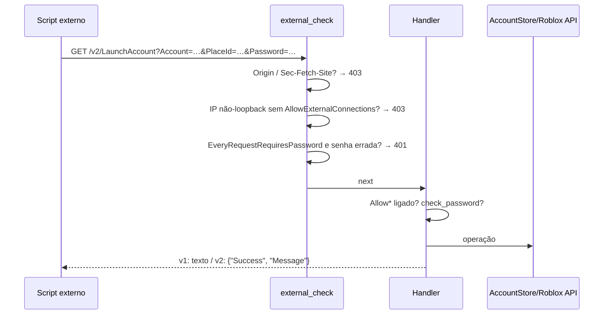

# Web server local (API HTTP)

## Objetivo

Expor uma API HTTP local (compatível com a do RAM legado, em versão `v1` texto e `v2` JSON) para scripts externos (ex.: executores Lua, automações) listarem contas, lerem/editarem campos, obterem cookies/CSRF e lançarem contas.

## Onde fica o código

| Arquivo | Papel |
|---|---|
| [Cargo.toml](../../src-tauri/Cargo.toml) | Feature `webserver = ["dep:axum"]` (incluída em `default`) |
| [api/server.rs](../../src-tauri/src/api/server.rs) | `build_router` (rotas) |
| [api/server/runtime.rs](../../src-tauri/src/api/server/runtime.rs) | `start` / `stop` / `is_running` / `get_port`, bind e graceful shutdown |
| [api/server/middleware.rs](../../src-tauri/src/api/server/middleware.rs) | `external_check` (bloqueio de páginas web, IP externo, senha global) |
| [api/server/handlers_basic.rs](../../src-tauri/src/api/server/handlers_basic.rs) | Running, GetAccounts(Json), ImportCookie, GetCookie, GetCSRFToken |
| [api/server/handlers_launch.rs](../../src-tauri/src/api/server/handlers_launch.rs) | LaunchAccount, FollowUser, SetServer, SetRecommendedServer |
| [api/server/handlers_edit.rs](../../src-tauri/src/api/server/handlers_edit.rs) | Alias/Description/Field, avatar, block/unblock; `check_password`, `check_password_required` |
| [api/server/query.rs](../../src-tauri/src/api/server/query.rs) | `AccountQuery` (parâmetros aceitos) |
| [api/server/helpers.rs](../../src-tauri/src/api/server/helpers.rs) | `reply` (formato v1/v2), `find_account` |
| [commands/services.rs](../../src-tauri/src/commands/services.rs) | Comandos Tauri `start_web_server`, `stop_web_server`, `get_web_server_status` (retornam erro "Web server is disabled in this build" sem a feature) |
| [lib.rs](../../src-tauri/src/lib.rs) | Auto-start no setup se `Developer.EnableWebServer` |
| [featureFlags.ts](../../src/featureFlags.ts) | `ENABLE_WEBSERVER` (env `VITE_ENABLE_WEBSERVER`, default `true`) para a UI |

## Fluxo

1. No setup do app, se `Developer.EnableWebServer = true`, `api::server::start` é chamado; também pode ser iniciado pela UI (`start_web_server`).
2. Bind em `127.0.0.1:<WebServerPort>` ou `0.0.0.0:<WebServerPort>` se `AllowExternalConnections`.
3. Cada request passa pelo middleware `external_check`, depois pelo handler (que aplica flag `Allow*` e senha).
4. `stop` envia sinal de shutdown pelo canal `watch`.

## Endpoints

Todas as rotas existem em `/<Nome>` (v1, resposta `text/plain`; erro também no header `ws-error`) e `/v2/<Nome>` (JSON `{"Success": bool, "Message": …}`). A conta é identificada por `Account` = username **ou** userId.

| Rota | Método | Parâmetros | Flag exigida | Senha |
|---|---|---|---|---|
| `Running` | GET | — | — | nunca (isento também do middleware) |
| `GetAccounts` | GET | `Group?` | `AllowGetAccounts` | `check_password` |
| `GetAccountsJson` | GET | `Group?`, `IncludeCookies?` | `AllowGetAccounts` (cookies: + `AllowGetCookie` + senha obrigatória) | `check_password` |
| `ImportCookie` | GET | `Cookie` | — | `check_password` |
| `GetCookie` | GET | `Account` | `AllowGetCookie` | `check_password_required` |
| `GetCSRFToken` | GET | `Account` | — | — |
| `LaunchAccount` | GET | `Account`, `PlaceId`, `JobId?`, `FollowUser?`, `JoinVIP?` | `AllowLaunchAccount` | `check_password` |
| `FollowUser` | GET | `Account`, `Username` | `AllowLaunchAccount` | `check_password` |
| `SetServer` | GET | `Account`, `PlaceId`, `JobId` | — | — |
| `SetRecommendedServer` | GET | `Account`, `PlaceId` | — | — |
| `GetAlias` / `GetDescription` | GET | `Account` | `AllowGetAccounts` | `check_password` |
| `GetField` | GET | `Account`, `Field` | `AllowGetAccounts` | `check_password` |
| `SetField` | POST | `Account`, `Field`, `Value` | `AllowAccountEditing` | `check_password` |
| `RemoveField` | POST | `Account`, `Field` | `AllowAccountEditing` | `check_password` |
| `SetAlias` / `SetDescription` / `AppendDescription` | POST | `Account` + body | `AllowAccountEditing` | `check_password` |
| `SetAvatar` | POST | `Account` + body JSON | `AllowAccountEditing` | `check_password` |
| `BlockUser` / `UnblockUser` | POST | `Account`, `UserId` | `AllowAccountEditing` | `check_password` |
| `GetBlockedList` | GET | `Account` | — | `check_password` |
| `UnblockEveryone` | POST | `Account` | `AllowAccountEditing` | `check_password` |

`GetAccountsJson` devolve `Username`, `UserID`, `Alias`, `Description`, `Group`, `Fields` (+ `Cookie` quando permitido).

## Regras de negócio

- **Anti-CSRF:** requests com header `Origin` ou `Sec-Fetch-Site` ≠ `none` (páginas web no navegador) recebem 403. Scripts/curl/executores não mandam esses headers.
- **Rede:** sem `AllowExternalConnections`, bind só em loopback e o middleware recusa IP não-loopback (403).
- **Senha (`WebServer.Password`):** precisa ter ≥ 6 caracteres; senão `check_password` e `check_password_required` sempre falham (401).
  - `EveryRequestRequiresPassword = true`: o middleware exige `password` correto em toda rota exceto `Running`.
  - `check_password`: se a senha for enviada, precisa bater; se omitida, passa (a menos que `EveryRequestRequiresPassword`).
  - `check_password_required` (cookies): a senha **sempre** precisa ser enviada e correta.
- **LaunchAccount/FollowUser (Windows):** aplica client settings (perfil Normal), Multi Roblox (erro 500 se não conseguir o mutex), fecha instância anterior se `AutoCloseLastProcess`, pega auth ticket com o cookie salvo, resolve VIP a partir de `privateServerLinkCode=`/`linkCode=`/`code=` no `JobId` quando `JoinVIP=true`, spawna (old join com `launch_old_join` → `default_player_dir`, a build do canal lido do registro; ou `launch_url`, a build de produção — ver [launch.md](launch.md#canal-do-roblox-e-a-tela-de-atualização-causa-raiz-e-fix)), rastreia o PID (12 s) e aplica o perfil pós-launch. Fora do Windows → 500.
- **Senha nas rotas de ação/edição:** `ImportCookie`, `SetField`, `RemoveField`, `SetAlias`, `SetDescription`, `AppendDescription`, `SetAvatar`, `BlockUser`, `UnblockUser`, `GetBlockedList` e `UnblockEveryone` chamam `check_password` (senha errada → 401). `GetCookie` e `GetAccountsJson?IncludeCookies=true` exigem `check_password_required` (sem senha correta, `GetCookie` → 401 e `IncludeCookies` é ignorado).
- **SetServer / SetRecommendedServer:** chamam `join_game_instance` na API do Roblox (não abrem cliente); o recomendado tenta os servidores públicos do último para o primeiro até um aceitar.
- **ImportCookie:** valida o cookie na API do Roblox e adiciona a conta ao store.

## Configurações relacionadas

| Seção | Chave | Default | Efeito |
|---|---|---|---|
| Developer | `EnableWebServer` | `false` | Inicia o servidor junto com o app |
| WebServer | `WebServerPort` | `7963` | Porta |
| WebServer | `AllowExternalConnections` | `false` | Bind `0.0.0.0` e aceita IP externo |
| WebServer | `Password` | (não criado) | Senha (mín. 6 caracteres) |
| WebServer | `EveryRequestRequiresPassword` | `false` | Senha obrigatória em todas as rotas (exceto Running) |
| WebServer | `AllowGetAccounts` | `false` | Listagem e leitura de alias/descrição/campos |
| WebServer | `AllowGetCookie` | `false` | Expor cookies |
| WebServer | `AllowLaunchAccount` | `false` | LaunchAccount / FollowUser |
| WebServer | `AllowAccountEditing` | `false` | Set/Remove Field, Alias, Description, SetAvatar, Block/Unblock/UnblockEveryone |
| Developer | `UseOldJoin`, `IsTeleport`; General `EnableMultiRbx`, `AutoCloseLastProcess` | — | Usados pelo LaunchAccount |

## Armadilhas / cuidados

- A feature `webserver` está no `default` do Cargo: builds normais incluem o servidor; só não sobe sem `EnableWebServer` ou start manual.
- Sem `Password` configurada (≥ 6), praticamente toda rota protegida retorna 401, mesmo com `EveryRequestRequiresPassword = false`.
- `GetCSRFToken`, `SetServer` e `SetRecommendedServer` não checam flag nem senha (a não ser via `EveryRequestRequiresPassword`) e usam o cookie da conta.
- `GetBlockedList` (leitura) e `ImportCookie` não exigem flag `Allow*`. As quatro rotas que **editam** a conta e ficavam de fora — `SetAvatar`, `BlockUser`, `UnblockUser` e `UnblockEveryone` — passaram a exigir `AllowAccountEditing`, como as de campo/apelido/descrição já exigiam. **Quebra de compatibilidade:** quem chamava essas rotas com o toggle desligado agora recebe 401 e precisa ligá-lo em Settings › Web Server.
- Com `AllowExternalConnections`, cookies e launches ficam acessíveis na rede — sempre combine com `EveryRequestRequiresPassword`.
- O launch pelo web server **não** usa catálogo de versões, isolamento, guarda de versão concorrente, `launch-log` nem detecção de conta moderada.
- Antes de aplicar client settings, o web server chama `refresh_production_version().await`, para os flags irem para a pasta da build de produção (se ela já estiver instalada) — a que o protocolo abre. Com `UseOldJoin` e o registro num canal que não é `production`, o cliente abre a build **desse canal** e não lê esses flags (ver [launch.md](launch.md#onde-o-clientappsettingsjson-é-gravado)).
- `ImportCookie` e as rotas de edição usam `check_password` (não o estrito): com `EveryRequestRequiresPassword = false`, omitir a senha ainda passa. Só a proteção anti-CSRF (Origin/Sec-Fetch-Site) e o bind em loopback impedem páginas web/rede de chamá-las.
- A senha trafega em query string em HTTP puro.
